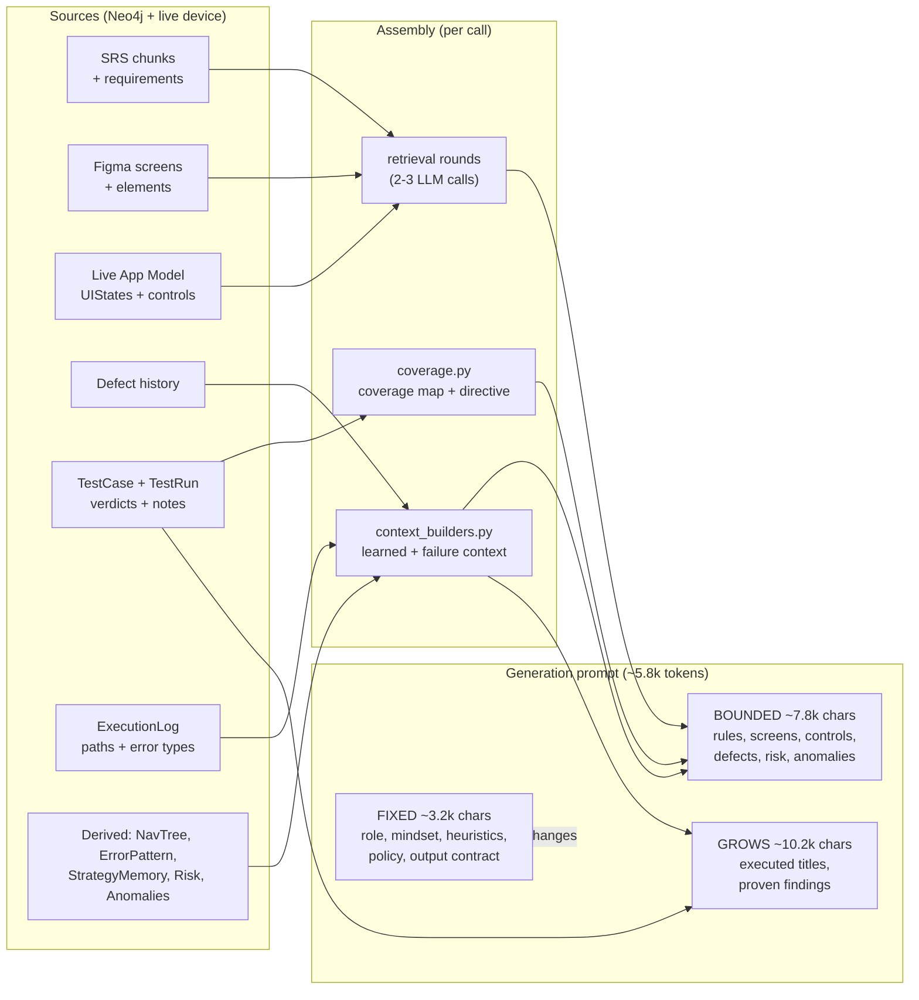

# Planner Prompt Anatomy

What the planner actually sends to the LLM on each generation call, which parts are constant,
which parts grow as testing proceeds, and where the ceilings are.

Measured on `contacts-app` after 22 executed tests (16 failures) and 15 observed app states:

> **23,081 characters ≈ 5,770 tokens** — about **0.6%** of the model's 1,000,000-token window.

Every LLM call is **stateless**. There is no conversation history: the prompt below is rebuilt
from the Neo4j graph from scratch, every single call. "Learning" means the graph grew, so the
next prompt is assembled from better facts — not that the model remembers anything.

To regenerate this measurement for your own project, dump the live prompt:

```bash
# writes logs/planner_prompt_preview.txt and prints a per-block size table
./venv/bin/python scripts/dump_prompt.py      # see "Reproducing" at the bottom
```

---

## How the prompt is assembled



---

## Block-by-block

Legend — **FIXED**: identical on every call. **BOUNDED**: content changes, size capped by a hard
limit. **GROWS**: size scales with how much testing has happened, up to a cap.

| # | Block | Chars | Class | Grows with | Ceiling |
|---|---|---:|---|---|---|
| 1 | Role + session objective | 188 | FIXED | — | — |
| 2 | `## Exploratory testing mindset` | 718 | FIXED | — | — |
| 3 | `## Live Coverage State` | 280 | GROWS | number of feature **areas** tested | ~1 line per area |
| 4 | `## Exploration Directive` | 423 | BOUNDED | — | 3 hot spots, 5 uncovered areas |
| 5 | `## Business Rules & Requirements (from SRS)` | 1,397 | BOUNDED | retrieved SRS chunks | 8,000 chars |
| 6 | `## App Screens & UI Structure` | 1,271 | BOUNDED | Figma screen count | 4 buttons / 4 inputs per screen |
| 7 | `## Interactive Elements on Relevant Screens` | 3,904 | BOUNDED | screens + observed states | 2 Figma screens, 12 live states × 8 controls |
| 8 | `## Defect History Context` | 583 | BOUNDED | ingested defects | 2,000 chars |
| 9 | `## Known Failed Navigation Paths` | 553 | BOUNDED | nav-tree avoid nodes | 8 entries |
| 10 | `## Regression Risk Assessment` | 532 | BOUNDED | scored areas | 6 areas |
| 11 | `## Emerging Anomalies` | 491 | BOUNDED | detected alerts | 5 alerts |
| 12 | `## Strategy Suggestions` | 226 | BOUNDED | strategy memory | 4 strategies |
| 13 | `## Executed Tests` (dedup list) | 2,903 | **GROWS** | **every test generated** | **120 titles** |
| 14 | `## What Previous Tests Already Proved` | 7,273 | **GROWS** | **every test that failed** | **25 findings × 300 chars + 5 patterns** |
| 15 | `## Exploratory Testing Heuristics` | 718 | FIXED | — | — |
| 16 | `## Strict Decision Policy` | 1,191 | FIXED | — | — |
| 17 | `## Output — STRICT JSON only` | 414 | FIXED | — | — |

**Totals:** FIXED ≈ 3,229 chars (14%) · BOUNDED ≈ 9,657 (42%) · GROWS ≈ 10,456 (45%).

Not shown above: the **retrieval-planning** calls that precede generation (2–3 smaller prompts,
~1.6–2.7k tokens each) which decide *which* SRS queries and screens to pull. Those are what you
see as the smaller entries in the OpenRouter usage log.

---

## What actually grows, and how fast

Only two blocks scale with session length.

**Block 13 — Executed Tests.** One line per test ever generated, used to forbid duplicates.
At ~90 chars per title that is roughly **90 chars per test**, hard-capped at 120 titles
(~11k chars). Past 120, the oldest tests stop being duplicate-blocked.

**Block 14 — What Previous Tests Already Proved.** One entry per *failed* test: title plus the
real failure reason, trimmed to 300 chars. Roughly **400 chars per failure**, capped at 25
entries (~10k chars) plus 5 mined error patterns. Past 25, older findings drop out.

```
prompt size ≈ 3,200 (fixed)
            + ~9,700 (bounded blocks, roughly flat)
            + 90 × min(tests, 120)
            + 400 × min(failures, 25)
```

| Session length | Approx. prompt | % of 1M window |
|---|---:|---:|
| 0 tests (cold start) | ~9,000 chars ≈ 2.3k tokens | 0.2% |
| 22 tests / 16 failures *(measured)* | 23,081 chars ≈ 5.8k tokens | 0.6% |
| 60 tests / 40 failures | ~28,300 chars ≈ 7.1k tokens | 0.7% |
| 120+ tests / 25+ failures **(saturated)** | ~30,900 chars ≈ 7.7k tokens | 0.8% |

**The prompt cannot grow past roughly 8k tokens.** Every unbounded input has a cap, so the
prompt plateaus — it never approaches the context window. That is the important thing to
understand: the system is not context-limited, it is **cap-limited**, and the caps were chosen
conservatively.

### The consequence of saturating

When a cap is hit, the excess is **dropped, not summarised**. Concretely, past 120 tests the
planner can regenerate an old test because it is no longer in the dedup list; past 25 findings
it can re-discover an old defect because the finding is no longer in its context. Aggregates
(coverage percentages, risk scores, strategy effectiveness, error patterns) are computed over
the **whole** history in the database, so the *shape* of history survives — only the
per-test detail is lost.

Raising the caps is nearly free at current sizes. The principled fix once they genuinely bind
is a summariser pass that compresses old findings into a short "what we know about this app"
memo instead of discarding them.

---

## Where each block comes from

| Block | Built by | Data source |
|---|---|---|
| 3, 4 | `planner/coverage.py` | `TestCase.last_verdict` + `area`, Figma screen purposes |
| 5 | `POST /retrieve` | SRS `Chunk` embeddings + keyword, defect-weighted |
| 6, 7 | `planner/context_builders.py`, `sources/figma_ui.py`, `sources/liveui.py` | `FigmaScreen`/`UIElement`, `UIState.key_set` |
| 8 | `sources/defects.py`, `GET /defects/context` | `Defect` nodes |
| 9 | `GET /navtree/failed-paths` | `NavTreeNode.avoid` |
| 10 | `GET /risk/scores` | `FeatureArea.regression_risk_score` |
| 11 | `GET /anomalies` | `AnomalyAlert` |
| 12 | `GET /strategy/memory` | `StrategyMemory` (decay-weighted) |
| 13 | `POST /context/brief` | `TestCase.title` |
| 14 | `context_builders.build_failure_context` | `TestCase.last_notes` + `GET /execution/error-patterns` |
| 1, 2, 15–17 | `planner/prompts.py` | hardcoded |

---

## Known gaps — data in the graph that is *not* in the prompt

| Available | Why it matters |
|---|---|
| **16 extracted `ValidationRule` nodes** (with `FR-` ids, confidence, provenance) | Block 5 sends raw SRS chunk text instead, containing **no `FR-` identifiers** — yet the output contract asks the model to cite requirement ids. |
| **Uncovered requirements** (`GET /coverage/requirements`) | Coverage is communicated per *area* only. The planner is never told which specific requirements have no test. |
| **Per-step device actions** (`logs/trajectories/*/trajectory.json`) | Only the final failure reason is fed back, not which interactions provably worked. |
| **Screenshots** (`data/appmodel/<project>/*.png`) | Never sent. Pure-Compose screens expose zero control names structurally, so those screens are effectively invisible in text. |
| **35 `Entity` nodes**, defect `root_cause_category`, per-test effectiveness | Computed and stored; unused in generation. |

---

## Reproducing this

The generation prompt is also retrievable at runtime — pass `debug_trace: true` to
`POST /agent/next-testcase` and read `debug_trace.final_prompt` (this costs a real generation).

For a zero-cost dump, rebuild the prompt from the graph with the same builders the agent uses
(`rag_client.get_brief_context` → `coverage.compute_coverage_map` →
`context_builders.build_learned_context` / `build_failure_context` →
`prompts.build_testcase_prompt`) and write it to a file. The per-block table above was produced
by splitting that output on `\n## `.
