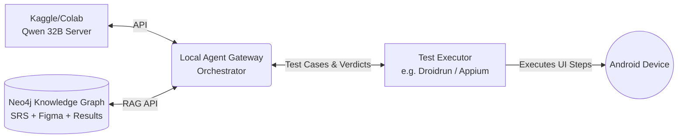

# Exploratory Testing Planner Agent Architecture

This document provides a comprehensive overview of how the QA Test-Case Planner works, focusing on its multi-stage retrieval planning and its iterative interaction with a test executor (e.g., Droidrun).

## 1. High-Level System Architecture

The ecosystem relies on decoupling the intelligence (the LLM), the knowledge (the Graph DB), the orchestration (the Gateway), and the execution (the Player).



## 2. The Multi-Stage Retrieval Loop (Generating ONE Test Case)

When the executor asks for the next test case (`POST /agent/next-testcase`), the gateway doesn't just prompt the LLM to blindly guess a test. It initiates an **Action-Observation** loop, allowing the LLM to "read up" on the system iteratively.

```mermaid
sequenceDiagram
    participant E as Executor (Droidrun)
    participant G as Gateway (Orchestrator)
    participant R as Neo4j RAG (Knowledge)
    participant M as LLM (Qwen)

    E->>G: POST /agent/next-testcase
    
    %% Bootstrapping
    G->>R: Fetch global summary & recent failed tests
    R-->>G: Compact JSON (e.g. "Previous test failed on Email Validation")
    
    %% Planning Round 1
    rect rgb(30, 41, 59)
    Note over G,M: Retrieval Round 1
    G->>M: Context so far: Summaries + Failures. What do you need?
    M-->>G: {"action": "retrieve", "requests": ["email format rules from srs", "Create Contact UI elements"]}
    G->>R: Query Graph DB for requested specific details
    R-->>G: Exact SRS snippets & Button/Input names
    end

    %% Planning Round 2 (Optional)
    rect rgb(30, 41, 59)
    Note over G,M: Retrieval Round 2 (If needed)
    G->>M: Here is what you asked for. Next action?
    M-->>G: {"action": "retrieve", "requests": ["How to navigate from Contact to Details"]}
    G->>R: Query Graph DB for screen transition edges
    R-->>G: Navigation paths snippet
    end

    %% Generation
    rect rgb(20, 83, 45)
    Note over G,M: Final Output Phase
    G->>M: Here is what you asked for. Next action?
    M-->>G: {"action": "produce_testcase"}
    G->>M: Generate STRICT JSON test case using ALL collected context.
    M-->>G: {"test_case_id": "TC-004", "title": "...", "steps": ["..."]}
    end
    
    G-->>E: Returns TC-004 (Ready to run)
```



### Why this is powerful:
By asking localized queries first, the LLM forces the RAG to pull up **specifically relevant** rules and UI elements, rather than flooding the LLM's context window with the entire 200-page SRS document and 50 Figma screens. The resulting test case accurately references actual button IDs and constraints.

## 3. The Continuous Execution Loop (The "One-by-One" Workflow)

Because exploratory testing requires adaptation, the system generates tests one at a time. The execution verdict of `Test Case N` determines the focus of `Test Case N+1`.

```mermaid
flowchart TD
    Start([Start Testing Session]) --> Req1[Executor Requests Test Case]
    
    subgraph Multi-Stage Planner Gateway
    Req1 --> Plan[Plan & Retrieve Context via RAG]
    Plan --> Gen[Generate JSON Test Case]
    end
    
    Gen --> Run[Executor Parses JSON Steps]
    
    subgraph Execution Player (Droidrun)
    Run --> S1[Find UI Element in App]
    S1 --> S2[Interact / Assert State]
    S2 -- "Success" --> Pass((Verdict: PASS))
    S2 -- "Crash / Element Missing" --> Fail((Verdict: FAILED))
    end
    
    Pass --> Log[Log Verdict & Notes to Gateway]
    Fail --> Log
    
    Log -->|Updates Knowledge Graph instantly| Req1
```

### How Failure Drives Adaptation
If Droidrun reports `FAILED` with a note like *"Button 'Save' was unresponsive during Email Validation"*, that failure gets embedded in the Neo4j Graph as part of the `Recent tests history`.

When the loop restarts and hits the **Plan & Retrieve** stage again, the LLM reads: *"Recent failure: Email Validation UI, Save button unresponsive"*. 

The LLM follows a strict decision policy: **Prefer tests adjacent to failed behaviors or that close a coverage gap**. Because it sees blood in the water, it won't move on to a random features (like "Settings"). Instead, it will immediately pivot to generating a new targeted edge-case test heavily scrutinizing the Email entry page, helping you map out exactly how broken that feature is.
