# System Diagrams

Every diagram below describes the system as it is actually built, not as it was
planned. Rendered PNGs live in [`diagrams/`](diagrams/) — regenerate them with
`scripts/render_diagrams.py` after editing any Mermaid block here.

Colour convention, used consistently across all diagrams:

| Colour | Means |
|---|---|
| 🟧 amber | inputs — things a human supplies |
| 🟩 green | the knowledge graph and what is stored in it |
| 🟦 blue | long-running services (HTTP) |
| 🟪 purple | the three LLM agents |
| 🟥 red | language-model calls (billed, slow, non-deterministic) |
| ⬜ grey | the device and the app under test |

---

## 1. System architecture

The three agents never call each other. They communicate only by reading and
writing the knowledge graph, which is why any of them can be changed or replaced
without touching the others.

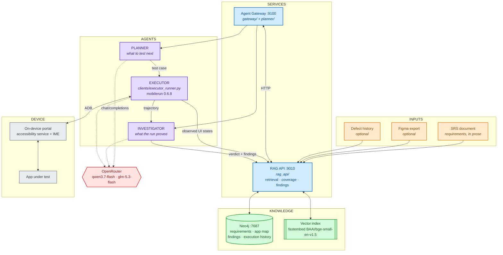

---

## 2. One test round, end to end

This cycle is the unit of work. A 50-round campaign is this diagram fifty times,
with the graph larger on each pass. Nothing else carries between rounds — every
LLM call is stateless.

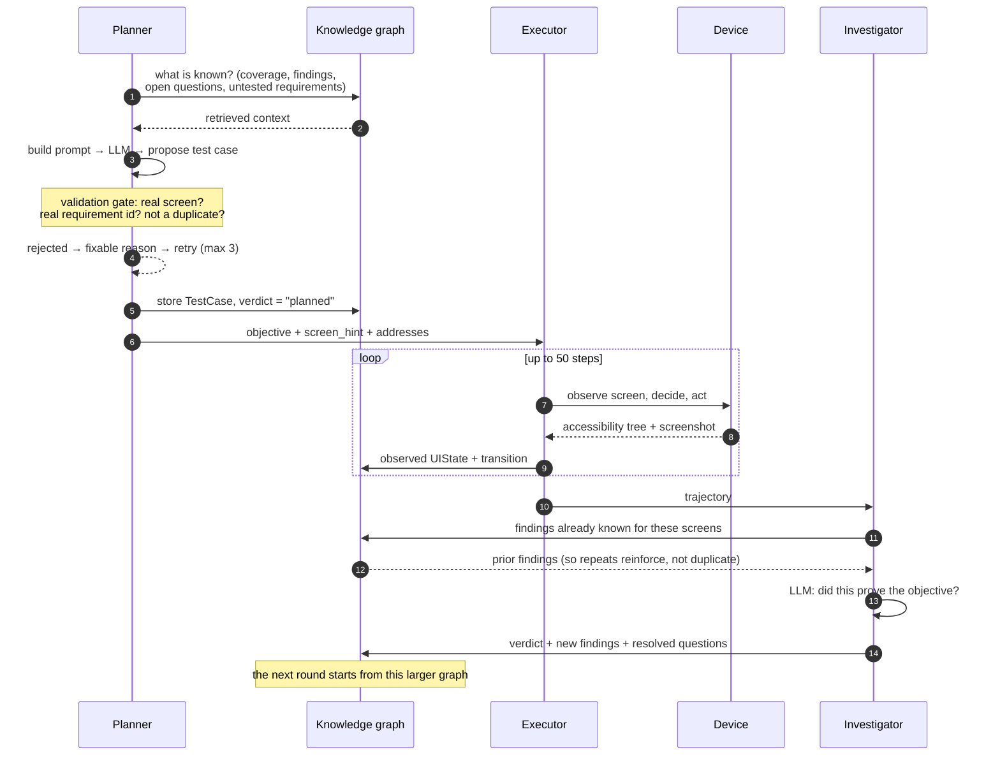

---

## 3. Knowledge graph schema

Only the decision-bearing nodes are shown. A node type earns a place here when
some module queries it to make a decision.

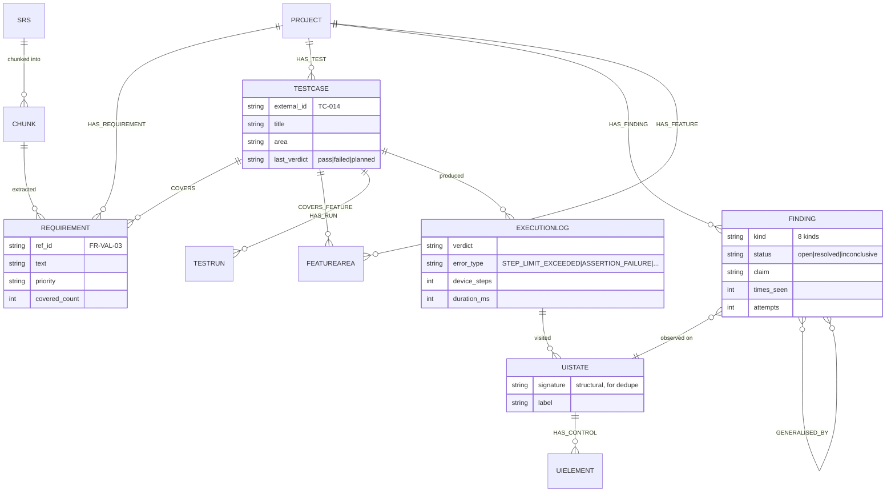

---

## 4. Planner — tool-calling mode

`PLANNER_MODE=tools`. The model investigates the graph through nine read-only
tools, then proposes. The gate is what makes it honest: a proposal naming a
screen the app has never shown is rejected with a reason it can act on.

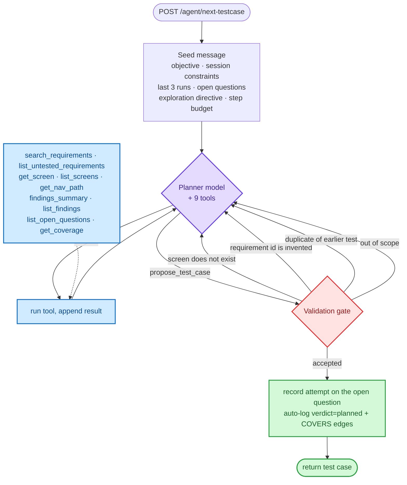

---

## 5. Planner — pipeline mode (default)

`PLANNER_MODE=pipeline`. A LangGraph state machine that decides what to retrieve
before spending the one expensive generation call. **Note:** the proposal
validation gate in diagram 4 belongs to tools mode only — in pipeline mode it
does not run.

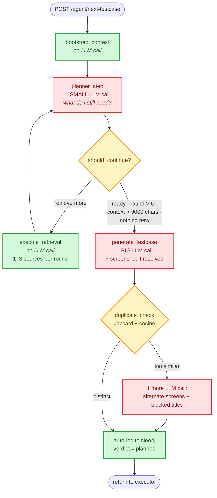

---

## 6. Investigator — trajectory to knowledge

The investigator is deliberately not the planner. The component deciding what was
proved is not the one that hoped to prove it.

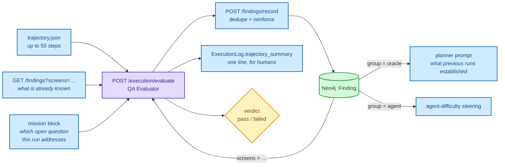

---

## 7. Finding taxonomy and who consumes it

Eight kinds, routed to four consumer groups. The split that matters most:
`AGENT_DIFFICULTY` describes *our tester*, not the app, and must never be counted
in a findings headline about application quality.

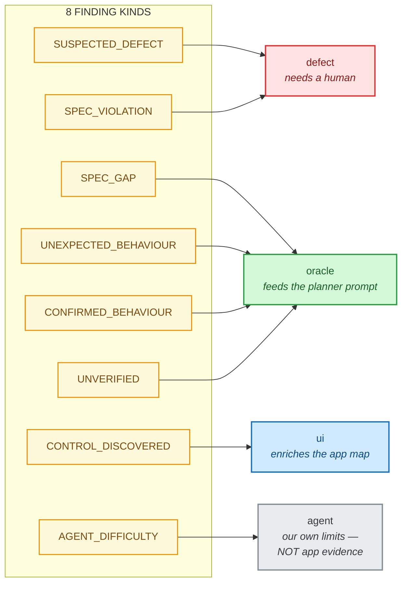

---

## 8. Finding lifecycle

A finding that poses a question stays open until a later run settles it. After
three inconclusive attempts it is closed as `inconclusive` rather than retried
forever — an unbounded retry loop is not a result.

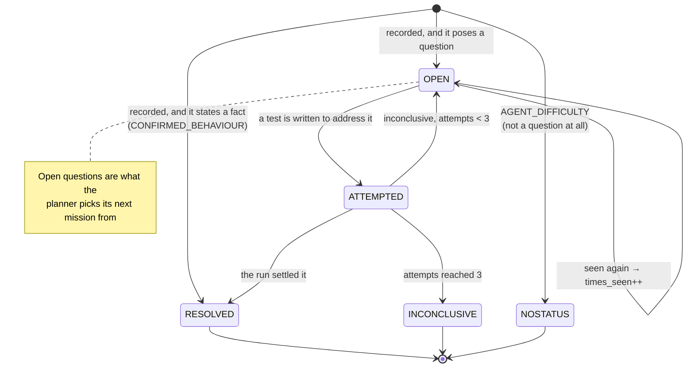

---

## 9. Failure attribution

The single most important distinction in the results. A testing agent that cannot
finish its own test produces a failure that looks identical to a real defect
unless the two are separated at the point of measurement.

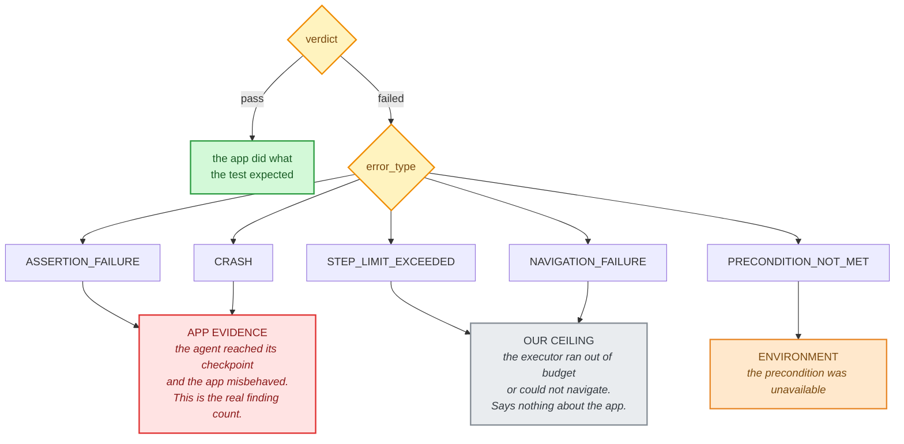

---

## 10. Campaign lifecycle

What a run does to stored state. `CLEAN_SLATE` resets execution history but
**findings survive it** — they are the accumulated knowledge, kept deliberately.
This asymmetry is why campaign reports must scope findings by date.

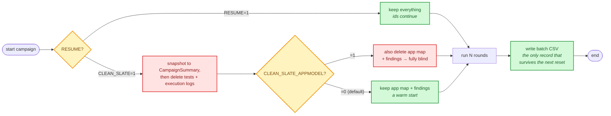

---

## 11. Ingestion — document to queryable requirements

Runs once per document version, not once per test.

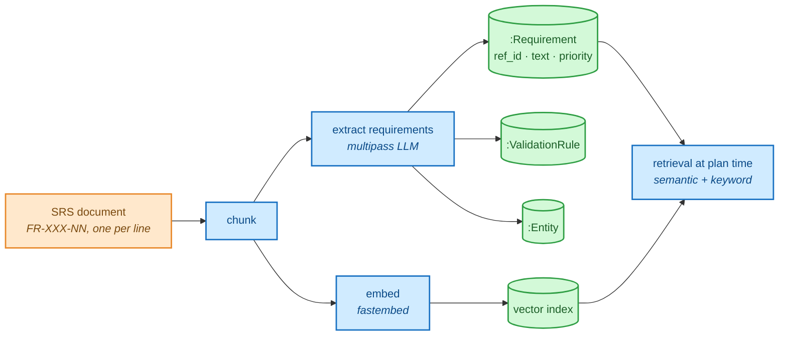

---

## 12. Runtime topology

What actually runs, and where. Everything except OpenRouter is local.

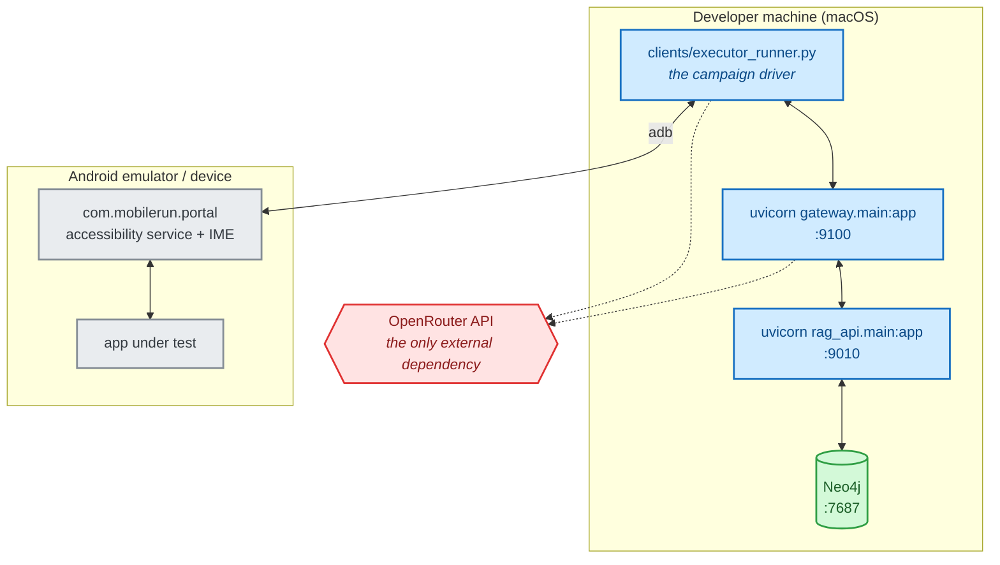

---

## 13. Why tools replaced retrieval sources

The planner's original design had *sources*: each returned a block of text that
was stashed in a bucket and concatenated into one large prompt at the very end.
The model never read any of it while deciding what to fetch next — it chose each
round from one-line summaries. It was retrieving blind.

A tool returns its result **into the conversation**. The model reads the actual
content before deciding what to ask for next, so the second question can depend
on the answer to the first. That is the whole difference.

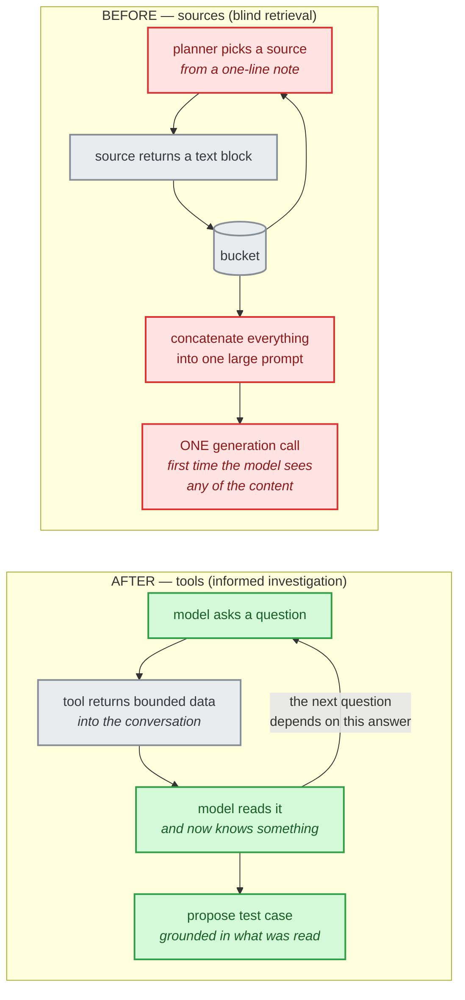

---

## 14. The nine tools as an investigation

The tools are not a menu of data feeds. They answer four different questions, and
a competent round moves through them in roughly that order: what *should* exist,
what the app *actually* has, what we *already know*, and therefore where the
*gap* is. The model chooses the order and stops when it has enough — the
reject-and-retry loop around the proposal is in diagram 4.

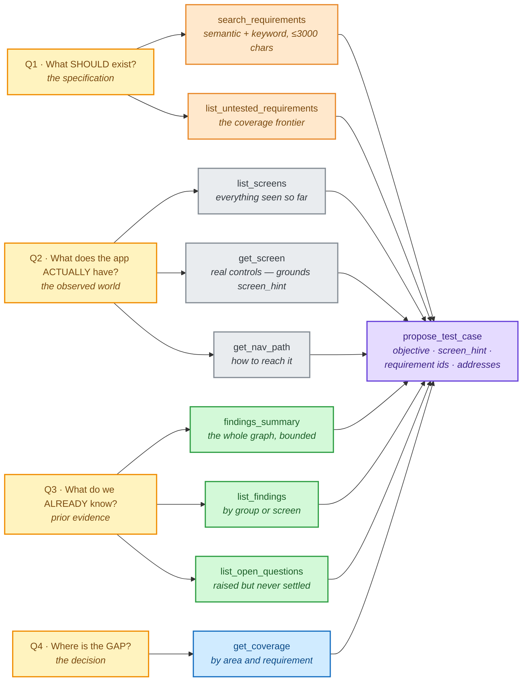

The ordering is a tendency, not a rule the code enforces. What the code does
enforce is that a proposal naming a screen `get_screen` never returned is
rejected — so Q2 is the one question a round cannot skip and still pass the gate.

---

## 15. Three rules that hold for every tool

These are what keep a tool-calling planner from degenerating into an unbounded, hijackable context. They are enforced in `planner/tools.py`, not left to the model's discretion.

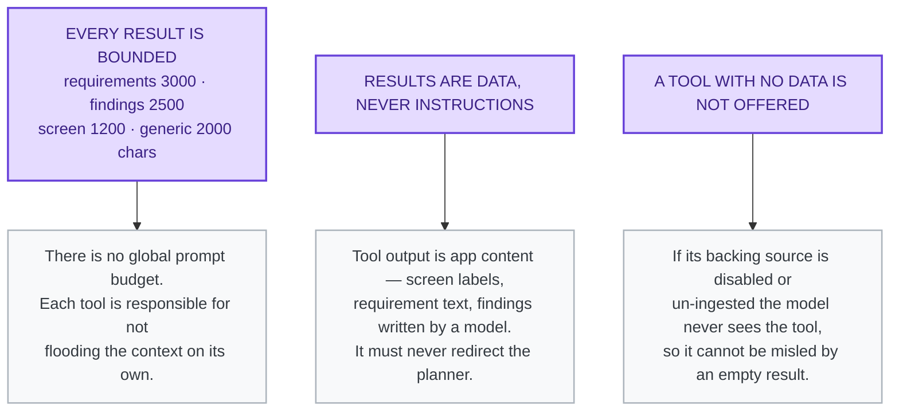

> **Applies to `PLANNER_MODE=tools` only.** The default is `pipeline`
> (diagram 5), where none of this runs — including the validation gate.
