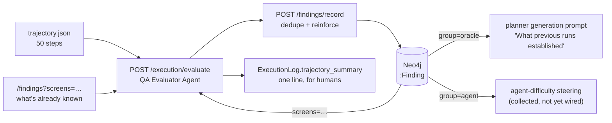

# The Investigator — turning a device trajectory into durable knowledge

What happens between the executor finishing a run and the planner knowing something new.
For the planner's own generation call see [PLANNER_PROMPT_ANATOMY.md](PLANNER_PROMPT_ANATOMY.md);
for the state machine that produces test cases see [System_Architecture.md](System_Architecture.md).

The investigator is the **third LLM role** in the system, alongside the planner
(`qwen/qwen3.7-flash`) and the executor (`qwen/qwen3.7-flash`). It runs as
`POST /execution/evaluate` on the gateway, uses `EVALUATOR_MODEL`
(`z-ai/glm-5.3-flash`), and appears in OpenRouter's dashboard as **QA Evaluator Agent**.

Its job in one line: **the executor reports a verdict; the investigator works out what the run
actually established.**

---

## 1. Why it exists

A verdict is almost no information. `TC-002 | failed | "max step count reached"` tells the
planner nothing about the app — not which screens exist, not what the agent saw, not whether
the thing under test was ever reached. Without that, the planner keeps writing variants of a
test whose answer is already sitting in a trajectory file nobody read.

The trajectory holds the real evidence: every thought, every tap, every resulting screen. The
investigator reads it against what the test set out to verify, and writes down what is now
known.

---

## 2. The unit of knowledge: a finding

The investigator used to emit **one long prose report per run** — "there is no length limit,
use as much space as the run warrants". That failed in a specific, measurable way.

Prose has no addressable unit. Nothing can be retrieved per screen, nothing can be
deduplicated, so the only way to carry knowledge forward was to re-feed whole reports. Measured
on this project before the redesign:

| | measured |
|---|---|
| Investigator prompt on TC-007 | 97,796 ch, of which **86,008 (88%) was previous reports** |
| Planner's generation prompt on TC-007 | 51,002 ch, of which **35,233 (69%) was the same reports** |
| Report length, first → seventh evaluation | 5,926 → **23,665 ch** (each one reads all the others) |
| Output format | JSON on 7 of 14 runs, markdown prose on the other 7 |
| Result | evaluation timing out past a **600 s** client timeout |

A **finding** is the addressable unit that fixes this: one atomic claim, its kind, the screen it
concerns, and the step evidence behind it. Findings accumulate in Neo4j, are matched on write so
a repeat *reinforces* an existing node rather than creating a new one, and are retrieved per
screen at the point of use.

```json
{"claim":  "Saving Farm Info with an empty farm name shows a success message and no validation error",
 "kind":   "SPEC_VIOLATION",
 "screen": "খামারের তথ্য আপডেট",
 "evidence": "steps 12-14: cleared EditText idx 12, tapped নিশ্চিত করুন, success toast shown",
 "severity": "high", "confidence": "high",
 "requirement_ids": ["FR-FARM-04"],
 "confirms": ""}
```

Volume is bounded **structurally** — at most 15 findings per run, `claim` ≤ 240 chars,
`evidence` ≤ 500 — not by asking the model to be brief. That distinction matters: the original
"no length limit" instruction existed because an earlier word limit had compressed away the
specific detail that makes a finding actionable. Structure bounds the volume; the fields stay
long enough to carry evidence.

---

## 3. The taxonomy

Kinds are defined by **which consumer routes on them**. A category nothing routes on is one the
model fills inconsistently, so every kind below has exactly one destination.

| kind | decision rule | consumed by |
|---|---|---|
| `SPEC_VIOLATION` | contradicts a requirement you can name (must cite `requirement_ids`) | bug oracle, review, risk |
| `SUSPECTED_DEFECT` | violates a universal expectation (validation, feedback, reversibility, no crash/data loss) with no requirement to cite | bug oracle, review |
| `CONFIRMED_BEHAVIOUR` | the app did the right thing and it was seen to work | bug oracle — *stop re-verifying this* |
| `SPEC_GAP` | real behaviour the requirements never describe | bug oracle, SRS drift |
| `UNEXPECTED_BEHAVIOUR` | surprising, but not judgeable right or wrong | bug oracle |
| `UNVERIFIED` | the run could not determine something it set out to, and why | bug oracle — *prevents assumed coverage* |
| `CONTROL_DISCOVERED` | a real control/label/screen seen at runtime | UI context. **Never** bug evidence |
| `AGENT_DIFFICULTY` | **our own agent** struggled | test-design steering. **Never** bug evidence |

`AGENT_DIFFICULTY` is mandatory for three patterns the investigator must always call out as
their own findings: an action repeated on the same element with no visible effect (stating how
many times), an action on non-interactive content, and reaching the right screen then navigating
away before finishing.

Groups (`oracle` · `defect` · `ui` · `agent`) are defined **once**, in
[`rag_api/findings.py`](../rag_api/findings.py), and requested by name via `GET /findings?group=oracle`.
Consumers never restate the mapping locally — a duplicated taxonomy is how this project once
reported 100% autonomy when it was 67%.

---

## 4. What the investigator is given

```
1. objective / expected result / assumed screen      the test's own intent
2. screens this run actually visited                 ExecutionLog.path_labels
3. structural facts about those screens              /appmodel/graph controls   (~0.1-1.2k ch)
4. findings ALREADY RECORDED for those screens       /findings?screens=…        (~1.3k ch, capped at 12)
5. the trajectory                                    thought + action per step  (capped at 50 steps)
6. the agent's own final outcome                     success + reason
7. the output contract                               fixed, ~3.0k ch
```

Block 4 is the load-bearing change. It replaced two blocks that had no ceiling — an app-model
dump and *every previous evaluation's full report* — with a bounded list of one-liners, each
carrying a short ref, scoped to the screens **this run touched** rather than the whole campaign.
Before the redesign, five prior findings cost 86,008 characters; the same five now cost 1,333.

---

## 5. Deduplication is model-led, not embedding-led

The obvious design is cosine similarity over claims. **It does not work here**, and the
measurement is worth keeping because it is counter-intuitive:

```
"Saving Farm Info with an EMPTY name → success message, no validation error"
"Saving Farm Info with an OVER-LONG name → silently truncates, no warning"      = 0.8532
"Saving Farm Info with an empty name …"  vs a true restatement of itself        = 0.8463
```

Two genuinely distinct defects on one screen score **higher** than a real paraphrase — and
adjacent variants like that are exactly what exploratory testing produces most of. No threshold
separates the classes.

So the **evaluator decides**: it is shown existing findings with refs (`F-1a2b3c4d`) and sets
`confirms` on any finding that restates one. It holds the step evidence and can trivially tell
"empty" from "over-long". Cosine is demoted to a safety net for near-verbatim repeats the model
did not flag, at a deliberately conservative **0.90**, and restricted to the claim's own
**merge group** so a defect can never be absorbed by the passing case that would disprove it
(those two score 0.849 — high enough to merge under any useful threshold).

The asymmetry that sets these values: a **false merge destroys knowledge** (a second defect
silently disappears into the first); a **false split costs one duplicate node of ~240 chars**.
Cheap mistake, expensive mistake — tuned so the expensive one effectively cannot happen.

A reinforced finding gains the new run's evidence and `times_seen++`, which turns repetition
into a signal: seen once is a hypothesis, seen four times across independent runs is confirmed
behaviour.

---

## 6. Where findings go



```
(:Project)-[:HAS_FINDING]->(:Finding)
(:Finding)-[:ABOUT_SCREEN]->(:UIState)      best-effort by observed label
(:Finding)-[:FOUND_BY]->(:ExecutionLog)     every run that evidenced it
(:Finding)-[:CONCERNS]->(:Requirement)      when the claim cites one
```

The prose summary still exists on the `ExecutionLog` for the dashboard, but **no prompt reads
it any more**. Separating "readable by a human" from "consumable by a prompt" is the conflation
that caused the original growth.

### Lifetime across campaigns

Findings are cleared by the **`delete_appmodel`** slice of `POST /project/reset`
(`CLEAN_SLATE_APPMODEL`, default **false**) — *not* by `delete_tests` /
`CLEAN_SLATE`. This follows the rule the project already applies to the Live App Model:

> Test results are outcomes and must be wiped for a clean measurement. The app map is
> knowledge **about the app**, and deleting it makes every campaign start blind.

A finding ("this screen accepts an empty required field") is knowledge of exactly that kind. It
outlives the run that discovered it. Wiping findings each campaign would make the investigator
re-derive the same conclusions forever — the growth problem they exist to end — and would make
"the agent gets smarter across campaigns" untestable for the same reason it already was for
navigation memory.

So a default `./start.sh` campaign wipes tests, execution logs and navigation memory, and
**keeps** the app map and the findings.

---

## 7. Configuration

| setting | default | why |
|---|---|---|
| `EVALUATOR_MODEL` | `z-ai/glm-5.3-flash` | separate from the planner model so it can be tuned alone |
| `EVALUATOR_MAX_TOKENS` | `0` (uncapped) | **deliberate** — see below |
| `EVALUATOR_REASONING_EFFORT` | `low` | the real latency lever |
| `EVALUATOR_KNOWN_FINDINGS` | `12` | size of block 4 |

**Do not cap `EVALUATOR_MAX_TOKENS` on a reasoning model.** `glm-5.3-flash` answers
`400 "Reasoning is mandatory for this endpoint and cannot be disabled"` and bills its scratchpad
against `max_tokens` at roughly 20× the content it emits. A 6,000-token cap produced a
**completely empty response** on a real 50-step run. The answer is bounded by the structured
contract instead. Cap the scratchpad, measured on one real evaluation prompt:

| reasoning setting | latency | content | reasoning |
|---|---|---|---|
| default | 113.8 s | 5,104 ch | 12,673 ch |
| `effort: low` | **22.7 s** | 3,243 ch | 0 ch |

---

## 8. Failure modes

Every path is best-effort — a failure here costs one learning opportunity, never a broken run.

| failure | behaviour |
|---|---|
| trajectory folder missing / no device steps | `status: skipped`, logged to `logs/evaluation_skips.log` |
| model returns unparseable output | `status: unstructured`; raw text still stored on the ExecutionLog, **`evaluation_unstructured` degradation (MAJOR)** recorded |
| findings parse but `/findings/record` fails | `findings_not_recorded` degradation (MAJOR) — these findings are the product of the call, so losing them is never silent |
| model returns `"findings": []` | **valid and expected** — the run established nothing new. `parse_evaluation` returns `None` only on genuine parse failure, so "discovered nothing" is never confused with "did not parse" |

---

## 9. Measured before / after

**Single replay** — same test, same trajectory, same model, old prompt vs new:

| | before | after |
|---|---|---|
| Latency | 600 s client timeout | **22.1 s** |
| Prior knowledge in prompt | 86,008 ch (5 reports) | **1,333 ch** (5 one-liners) |
| Planner's observations block | 35,233 ch (69% of prompt) | **2,010 ch** |
| Output | 20,093 ch prose | 2,784 ch structured |
| Format stability | JSON 7/14, prose 7/14 | one contract |

**Live 3-round campaign** (6 Sep 2026, `shobarkhamar`, 21 min, 2 pass / 1 fail):

| | old design (n=14) | new design (n=5) |
|---|---|---|
| Mean evaluator input | 32,751 ch | **17,063 ch** |
| Mean evaluator output | 11,673 ch | **3,286 ch** |

Four evaluations produced 19 findings, **3 of them reinforcing an existing finding by ref**
rather than restating it. The direction of travel is the point: the prompt got *smaller* as the
campaign went on — 20,466 → 19,010 → 15,291 → 10,959 characters — because later runs cite prior
findings instead of re-deriving them. Under the prose design the same sequence grew from 28,344
to 97,796.

## 10. Inspecting a run

```bash
# every evaluation's exact input and output, appended per test case
less logs/investigator/TC-002.txt

# what the graph now knows, and how often each was independently observed
curl "http://127.0.0.1:9010/findings/stats?project=$PROJECT" | python3 -m json.tool
curl "http://127.0.0.1:9010/findings?project=$PROJECT&group=oracle&limit=10" | python3 -m json.tool
curl "http://127.0.0.1:9010/findings?project=$PROJECT&group=agent&limit=10"   | python3 -m json.tool

# the block the planner actually receives
./venv/bin/python -c "import sys;sys.path.insert(0,'.');from planner import context_builders as c;print(c.build_failure_context('$PROJECT',[]))"

# invariants (skips cleanly with no Neo4j)
./venv/bin/python tests/test_findings.py
```

---

## 11. Known gaps

1. **`AGENT_DIFFICULTY` findings are collected but nothing reads them yet.** They are stored,
   grouped and retrievable (`group=agent`); no prompt block consumes them. This is
   [ROADMAP.md](ROADMAP.md) #1, and the data it asked
   for now exists as a first-class kind rather than needing to be mined from `ExecutionLog`
   error types.
2. **Screen attribution is by label.** `_resolve_screens` matches the observed `UIState.label`
   or id. A finding whose screen the model names differently keeps `screen_label` but gets no
   `ABOUT_SCREEN` edge, so it is retrievable by kind but not by screen.
3. **No contradiction edge.** A finding can be reinforced but not yet *contradicted* — if the
   app is fixed, the old finding stays until a human clears it. `times_seen` and `last_seen`
   are the only staleness signals.
4. **Dedup is only as good as the retrieved block.** A repeat is only citable if that screen's
   finding appears in the 12 shown; the cosine safety net covers near-verbatim cases beyond it.
