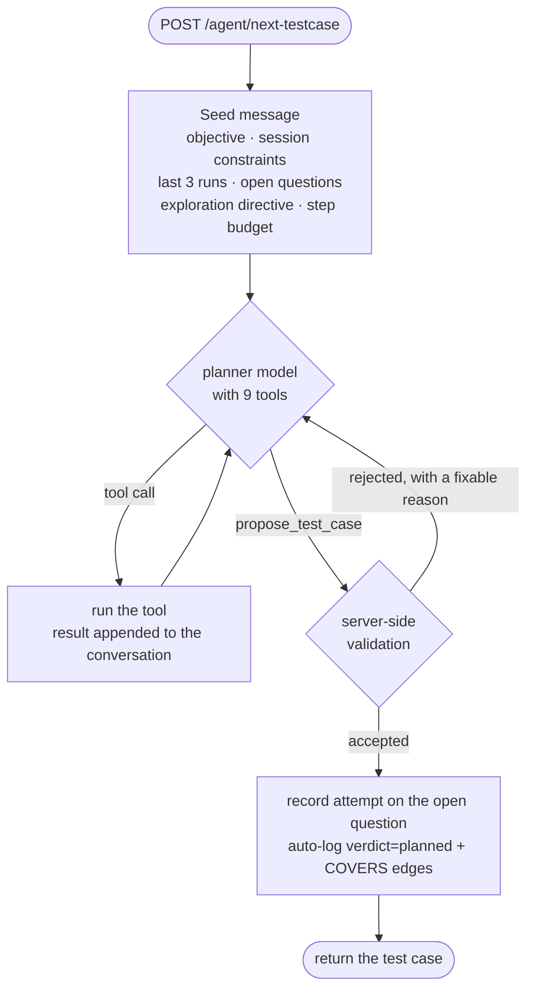

# How the planner works

The planner answers one question per round: **what should we test next?** It never touches the
device and never writes tap-by-tap steps — it produces a *goal*, and the executor works out how.

Two implementations exist side by side, selected by `PLANNER_MODE`. This document covers the
tool-calling planner (`tools`) in detail, then the pipeline planner (`pipeline`, still the
default) and why it is being replaced.

Companions: [PLANNER_PROMPT_ANATOMY.md](sus/PLANNER_PROMPT_ANATOMY.md) (the literal bytes) ·
[PLANNER_REDESIGN.md](PLANNER_REDESIGN.md) (why it was rebuilt) ·
[INVESTIGATOR.md](INVESTIGATOR.md) (what feeds it) ·
[start/System_Architecture.md](start/System_Architecture.md) (the whole system).

---

## 1. One round, end to end



Typical round: **7–8 turns, 12–18 tool calls, ~67 seconds**. Bounded by `MAX_TURNS` (12); from
turn `FORCE_PROPOSE_AFTER` (6) the model is told to propose and `tool_choice` is pinned to
`propose_test_case`, because a model left on `auto` will investigate to the ceiling and never
commit — observed on the first real run, which produced ten turns of tool calls and no proposal.

## 2. What it starts with

A deliberately small seed (~4,500 chars). Everything else it fetches itself.

| Block | What it does |
|---|---|
| **Session objective** | "generate the next high-value exploratory test case" |
| **Session constraints** | the role the device is signed in as, what the account *already has*, and `OUT_OF_SCOPE`. These override everything: a test for a role you aren't signed in as is wasted before it runs |
| **Your last N runs** | the executor's own recent history — see §5 |
| **Exploration directive** | from `coverage.build_exploration_directive()`, biased by `EXPLORATION_MODE` |
| **Open questions** | things earlier runs raised and never settled, inline with refs |
| **Execution budget** | the real numbers: 50 device actions, 900 seconds |

## 3. The nine tools

Each is a thin wrapper over an endpoint that already exists. **A tool whose knowledge source is
disabled or has no data is not registered at all**, so the model cannot call it and cannot be
misled by an empty answer.

| Tool | Answers | Available when |
|---|---|---|
| `search_requirements(query)` | "what rules govern this behaviour?" | an SRS was ingested |
| `list_untested_requirements(feature?)` | "what has no test yet?" — never-covered first | an SRS was ingested |
| `get_screen(name)` | "does this screen exist, and what is on it?" | executor has run ≥ once |
| `list_screens()` | "what screens exist at all?" | executor has run ≥ once |
| `findings_summary()` | "where is the open work?" — counts per screen × kind × status | always |
| `list_findings(screen?, group?)` | "what do we already know?" | always |
| `list_open_questions()` | "what did we start and never finish?" | always |
| `get_coverage()` | "where are the gaps, hot spots, dead ends?" | always |
| `get_nav_path(screen)` | "is there a proven route there?" | transitions recorded |

`group` on `list_findings` is resolved **server-side** (`oracle` / `defect` / `ui` / `agent`) so
the kind taxonomy has exactly one definition. This project once reported 100% autonomy when it
was 67% because a taxonomy was duplicated in two places.

### How it actually uses them

A real trace, unprompted — nothing in the system prompt prescribes this order:

```
SURVEY   list_screens · get_coverage · list_findings(oracle|defect|ui) · list_open_questions
GROUND   search_requirements("disease list loading empty state spinner")
         get_screen("রোগের তালিকা")          ← does it exist? what is on it?
NARROW   list_untested_requirements(feature="animal_record")
         get_screen(…) ×3 · search_requirements("FR-DIS …")
COMMIT   ATTEMPT F-c597ab66 -> open (1/3)
         PROPOSE accepted=True, rejections=0
```

Broad survey → ground a hypothesis in real requirements → **confirm the screen exists** →
narrow → commit. That shape emerges because the model reads real tool results; it cannot emerge
when it only sees one-line summaries of things it never read.

## 4. `propose_test_case` — the validating gate

The loop may only finish by calling it, and the server checks it **before** anything reaches a
device. Each failure returns a message the model can act on:

| Check | On failure |
|---|---|
| `screen_hint` names an observed `UIState`, or is `"unknown"` | lists the real observed screens |
| every `requirement_id` exists | names the invented ones |
| not a semantic duplicate (Jaccard + embedding cosine) | names the similar test and its score |
| not in `OUT_OF_SCOPE` | names the forbidden area |
| preconditions are creatable through the UI | quotes the offending precondition |

Rejections cap at `MAX_REJECTIONS` (3), after which the best effort is accepted and a
`planner_proposal_unvalidated` degradation is recorded — a planning round never returns nothing.

**Why this matters:** under the pipeline planner the named screen matched a real observed screen
about **16%** of the time, and the executor's goal text had to defensively call it "a LEAD, not
a fact" while the agent burned its step budget hunting for screens that do not exist. In 8 test
cases under the tool planner there was **1 rejection total**, and the model corrected on the next
turn rather than looping.

**Cold start caveat:** with an *empty* app model there is nothing to validate against, so the
check is skipped unless `REQUIRE_GROUNDED_SCREEN_HINT=1`. Default off.

## 5. Feedback the planner receives

Three channels, carrying genuinely different things:

| Channel | Says | Lifetime |
|---|---|---|
| **Findings** | what was established **about the app** | durable, survives `CLEAN_SLATE` |
| **Coverage** | aggregate patterns — hot spots, dead ends, exhausted areas | per campaign |
| **Recent runs** | how our **attempt** went — steps against budget, error type | single run |

The investigator says *"the objective was never verified."* The execution log says *"because it
burned 50 of 50 steps."* One is about the app; only the second can teach the planner to scope
smaller.

Recent runs are interpreted, not dumped:

```
## Your last 3 run(s) — of 12 executed this campaign
TC-012   failed 50/50 steps  STEP_LIMIT_EXCEEDED
TC-011   failed 50/50 steps  STEP_LIMIT_EXCEEDED
TC-010   pass    9/50 steps

TC-012: "Register a farm, add three animals and verify the marketplace listing"
  The executor ran out of budget before reaching a verdict, so this test produced
  NO evidence about the app. That is what an over-scoped test looks like…
WARNING: 2 of the last 3 runs exhausted the step budget. Your tests are
consistently too large — scope the next one down sharply.
```

The two newest get a full interpretation; the rest are one-liners so a *pattern* is visible. The
warning lines fire only on real repetition.

## 6. Open questions — reaching a conclusion

`UNVERIFIED`, `SUSPECTED_DEFECT` and `SPEC_VIOLATION` findings start life **open**. The planner
sees them in the seed, may target one by passing `addresses` on the proposal, and that spends one
of the question's attempts.

- Slots are **reserved**: half for questions already under way, half for fresh ones. Ordering by
  attempts alone starves one side — ascending means a half-investigated question is never shown
  again, descending means new discoveries never surface.
- Within the started pool, **most-attempted first**: a question at 2 of 3 is one probe from a
  conclusion either way.
- At `MAX_FINDING_ATTEMPTS` (3) it auto-closes as **inconclusive** — a result for a human, not an
  endless retry. This bound exists because an early campaign produced five near-duplicate tests
  that each burned the full step budget on an area the agent could not reach.
- A later run that answers it flips it to **resolved**, overriding the inconclusive close.

## 6b. Not getting stuck — area saturation

A measured failure: **9 of 13 tests in one campaign landed on a single screen**, and 20 of 74
findings described one text field. Three signals were all pointing at the same place, and none of
them could ever stop:

1. `farm_management` kept failing, so it was a **hot spot** — the directive put it at priority 1
2. the recent-runs note said *"a narrower follow-up probing the same behaviour…"* after every failure
3. failures on that screen created open questions about that screen

The structural bug was in (1): `hot_spots` promoted an area on `failed >= 2`, and the only exit —
`exhausted_areas` — required `failed == 0`. **A failing area was a one-way door.**

`AREA_SATURATION` (5) is the damping term. Past that many tests an area stops being promoted
whatever its verdicts, and the directive says so with the reason:

```
[PRIORITY 1] [EXPAND] Areas with ZERO test coverage yet: chat, orders
[SPENT] These areas have already had 5+ tests: farm_management. Whatever is wrong
        there is almost certainly already recorded — another variant of the same
        input on the same field adds little.
```

Signal (2) was softened to point at `get_coverage` / `findings_summary` first. Signal (3) is
addressed at the knowledge layer instead: clustered findings collapse into one general claim, so
one defect stops presenting as five open questions
([INVESTIGATOR.md](INVESTIGATOR.md) §"Generalisation").

**A rejected alternative, for the record:** "exhaust an area when it stops producing new
findings". Checked against the data first — the ninth test on that screen was *still* producing
technically-new findings, so it would never have fired. A spend cap was what was missing, not an
information-yield check.

## 7. What it deliberately does not do

**It never writes steps.** The output is a goal, because the planner cannot see the live app and
a wrong tap script is worse than a clear objective.

**It does not remember the previous round.** Every round rebuilds from the graph. "Learning" here
means the graph grew.

**It does not decide how big a test should be by itself** — it is told the budget (50 actions,
900s) and asked for one behaviour, and the recent-runs block closes the loop when it over-reaches.

---

## 8. The pipeline planner (`PLANNER_MODE=pipeline`, still default)

A LangGraph state machine: `bootstrap_context → planner_step ⇄ execute_retrieval →
generate_testcase → duplicate_check`. Only 3 of the 5 nodes call an LLM.

**Its structural defect:** in `execute_retrieval` each source returns a block with `.text` and
`.note`. The text goes into a bucket that is not read again until generation; only `.note` — one
line — reaches the next round. So the planner decides what to fetch next **without having read
what it just fetched**, then everything is concatenated into one ~19k-character prompt.

Three consequences, each patched after the fact rather than prevented: the unvalidated
`screen_hint`, post-hoc duplicate detection, and hallucinable requirement ids. All three are the
same missing capability — the planner cannot check anything against the graph while thinking.

It remains the default because the tool planner has not yet been proven better over a long
campaign. See [PLANNER_REDESIGN.md](PLANNER_REDESIGN.md) §7 for the comparison criteria.

## 9. Configuration

| Setting | Default | Effect |
|---|---|---|
| `PLANNER_MODE` | `pipeline` | `tools` selects the tool-calling planner |
| `OPENROUTER_MODEL` | `qwen/qwen3.7-flash` | the planner model; must support tool calling for `tools` |
| `PLANNER_REASONING_EFFORT` | `low` | scratchpad budget per turn |
| `ENABLED_SOURCES` | srs, live_ui, defects, navtree | a disabled source's tools are never registered |
| `EXPLORATION_MODE` | `balanced` | `explore` = breadth first, `exploit` = dig into failures |
| `AREA_SATURATION` | `5` | tests in one area before it stops being promoted as a hot spot (`planner/coverage.py`) |
| `REQUIRE_GROUNDED_SCREEN_HINT` | `0` | require `screen_hint='unknown'` on a cold start |
| `OUT_OF_SCOPE` | — | areas never to test; enforced at proposal time |
| `MAX_TURNS` / `FORCE_PROPOSE_AFTER` / `MAX_REJECTIONS` | 12 / 6 / 3 | loop bounds (`planner/agent_loop.py`) |

## 10. Where the code lives

| Path | Role |
|---|---|
| `planner/agent_loop.py` | the tool loop, seed message, recent-runs block, attempt recording |
| `planner/tools.py` | the 9 tools, their schemas, availability gating, output caps |
| `planner/proposal.py` | the validation gate and normalisation |
| `planner/model_client.py` | `chat_tools` transport, retry, fallback, rate-limit cooldown |
| `planner/langgraph_agent.py` | the pipeline planner state machine |
| `planner/coverage.py` | coverage map and exploration directive |
| `planner/prompts.py` · `budget.py` | pipeline-mode prompt assembly and token budget |
