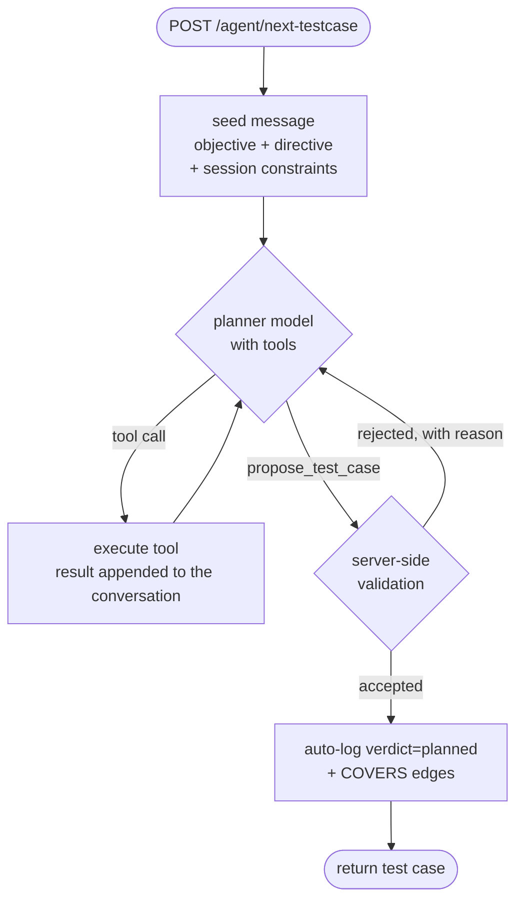

# Planner Redesign — from a retrieval pipeline to a tool-using agent

**Status: built and shipped** (6 Sep 2026, commit `d5cd158`), available behind
`PLANNER_MODE=tools`. `pipeline` remains the **default** until the comparison in §7 is settled.

This is the design record: why the old planner was structurally limited, what was built instead,
and what actually happened versus what was predicted. For what the two planners *are*, see
[System_Architecture.md](start/System_Architecture.md) §3–5. For the investigator that feeds them,
[INVESTIGATOR.md](INVESTIGATOR.md). For what's next, [ROADMAP.md](ROADMAP.md).

---

## 1. The core defect: the retrieval loop is blind

*(Still true of `PLANNER_MODE=pipeline`, which is still the default — this section is live
documentation, not history.)*

`planner/langgraph_agent.py` looks like an agent — it loops, it "decides what to retrieve
next" — but **the planner never sees what it retrieved.**

In `execute_retrieval`, each source returns a `RetrievedBlock` with `.text` and `.note`. The
`.text` goes into a bucket that is not read again until generation. Only `.note` — *one line* —
reaches the next round:

```python
bucket.append(block.text)                  # stored, unread until the end
round_retrieved_notes.append(block.note)   # this is all the next round sees
```

Measured on a real campaign:

```
TC-003.txt (4 LLM calls: 3 planner_step + 1 generate)
   planner_step (round 1)     in   6,805 ch      <- global context
   planner_step (round 2)     in   2,905 ch      <- decides round 3 from ONE-LINE NOTES
   planner_step (round 3)     in   3,129 ch      <-           "
   generate_testcase          in  19,118 ch      <- everything dumped at once
```

Rounds 2 and 3 each cost a model call to choose the next retrieval **without having read the
previous one**. The planner cannot tell whether what it fetched was useful, relevant, or empty.
Then every accumulated block is concatenated into one ~19k prompt and fitted to a 50k budget.

It is a retrieval **pipeline** wearing an agent's clothes. Three consequences showed up in the data:

**a. `screen_hint` is unvalidated.** `build_droidrun_goal` records that the planner's named screen
matched a real observed screen **~16% of the time**, and the goal text has to defensively call it
"a LEAD, not a fact". Nothing checked the name against the Live App Model before dispatch.

**b. Deduplication is post-hoc.** The planner writes a test, `duplicate_check` detects the overlap,
and one regeneration fires with a blocked-titles list. The planner can never *ask* "is this
already covered?" while deciding.

**c. `requirement_ids` are hallucinable.** Rule 7 of the generation prompt tells the model to copy
ids exactly and never invent one. Nothing enforces it.

All three are the same missing capability: **the planner cannot check anything against the graph
while it is thinking.**

---

## 2. What was built

A native tool-calling loop (`planner/agent_loop.py`) over 7 tools (`planner/tools.py`), each a
thin wrapper on an endpoint that already existed:

| tool | backed by |
|---|---|
| `search_requirements(query)` | `POST /retrieve` (hybrid vector + keyword) |
| `list_untested_requirements(feature?)` | `/coverage/requirements` |
| `get_screen(name)` | `/appmodel/graph` — real observed controls |
| `list_screens()` | `/appmodel/graph` |
| `list_findings(screen?, group?)` | `GET /findings` |
| `get_coverage()` | coverage map + exploration directive |
| `get_nav_path(screen)` | `/navtree/retrieve-path` |
| `propose_test_case({...})` | **validating terminal tool** (`planner/proposal.py`) |

Model support was verified against OpenRouter's model API rather than assumed:
`qwen/qwen3.7-flash` and `z-ai/glm-5.3-flash` both report `tools` and `tool_choice`.



The essential difference: **tool results enter the conversation**, so the model reasons over
content rather than one-line notes, and pulls only what it needs instead of receiving everything
that fits a budget.

### `propose_test_case` — where most of the value is

The loop may only finish by calling it, and the server rejects with a reason the model must act on:

| check | on failure |
|---|---|
| `screen_hint` names an observed `UIState`, or is `"unknown"` | lists the real observed screens |
| every `requirement_id` exists | names the invented ones |
| not a semantic duplicate (Jaccard + embedding cosine) | names the similar test and its score |
| not in `settings.OUT_OF_SCOPE` | names the forbidden area |
| preconditions are creatable through the UI | quotes the offending precondition |

After `FORCE_PROPOSE_AFTER` (6) turns the model is instructed to propose and `tool_choice` is
pinned to the proposal tool. Rejections cap at `MAX_REJECTIONS` (3), after which the best effort
is accepted and a `planner_proposal_unvalidated` degradation is recorded.

---

## 3. What actually changed — and what didn't

The original plan predicted deleting `planner/sources/*`, `planner_step`/`execute_retrieval`, and
most of `prompts.build_testcase_prompt`. **None of that was deleted**, because `pipeline` stayed
the default: both planners run side by side so a campaign can be compared. `planner/sources/`
(9 files) and `planner/budget.py` remain in active use by pipeline mode.

**Added:** `planner/tools.py`, `planner/proposal.py`, `planner/agent_loop.py`,
`model_client.chat_tools`, `GET /requirements/ids`, `PLANNER_MODE` dispatch in `pipeline.py`,
`tests/test_planner_tools.py` (23 checks).

**The `ENABLED_SOURCES` guard got stricter, as designed.** In pipeline mode a disabled source has
to be filtered in two places because content bypassing the registry still reaches the prompt. In
tool mode a disabled source's tool is **not registered**, so it cannot be called at all.

---

## 4. Cost, measured

| | pipeline | tools |
|---|---|---|
| LLM calls per test case | 4 (3 small + 1 × ~19k ch) | 7–8 turns, 12–15 tool calls |
| wall clock per test case | — | **~67s** (`qwen3.7-flash`, no rate limiting) |
| 3-round campaign, end to end | **1,266.9s** | **870.0s** |
| campaign verdicts | 2 pass / 1 fail | 2 pass / 1 fail |

The tools campaign was **31% faster end to end** despite doing more planning work. Latency is
dominated by whether the primary model is rate-limited: the same round took 191s when
`qwen3.8-flash` was returning 429s and falling back to a reasoning model on every turn. That is
what motivated the 180s rate-limit cooldown in `model_client`.

Keep it in proportion: executing one test costs up to `EXECUTOR_MAX_STEPS` (50) vision-bearing
calls. Planning is the cheap half, and one prevented bad `screen_hint` saves more than the whole
planning loop costs.

---

## 5. Risks predicted, and what happened

1. **"A model that loops calling tools without proposing must hit a ceiling."** ✅ **This
   happened on the first real gateway run** — ten straight turns of tool calls, no proposal, and
   the round returned nothing. The fallback only covered *failed* proposals, not "never
   proposed". Fixed with `FORCE_PROPOSE_AFTER` + pinned `tool_choice`.
2. **Rejection loops.** Capped at 3; in practice 8 test cases produced 1 rejection total, and the
   model corrected on the next turn rather than looping.
3. **"A real rewrite."** Done; mitigated by keeping both planners behind a flag.
4. **"Tool-calling quality is unmeasured."** Phase 0 answered it: 17 tool calls in a sensible
   order — coverage → prior findings → confirm screens exist → targeted search → propose.

One unpredicted failure: a provider `400` surfaced as a bare `400 Client Error` with no message,
which says nothing about *which* of `tools`/`tool_choice`/`reasoning` was rejected. `chat_tools`
now carries the provider's own message into the exception and falls back to `tool_choice: auto`
when a forced tool is refused.

---

## 6. Phasing — status

| phase | status |
|---|---|
| 0 — spike: can the model drive tools? | ✅ passed |
| 1 — validating `propose_test_case` | ✅ built |
| 2 — tool loop behind `PLANNER_MODE` | ✅ built, `pipeline` still default |
| 3 — delete the pipeline | ⛔ **blocked on §7** |

---

## 7. How we would know it is better — still open

| metric | pipeline | tools | status |
|---|---|---|---|
| 3-round campaign duration | 1,266.9s | 870.0s | measured |
| proposals rejected | n/a | 1 of 8 | measured |
| `screen_hint` matches a real observed screen | ~16% | grounded by construction | **not yet measured over a campaign** |
| tests citing a requirement id that exists | unmeasured | 100% by construction | not independently verified |
| runs ending `STEP_LIMIT_EXCEEDED` | dominant agent failure | — | **not measured** |
| autonomy (non-agent-fault runs) | ~50% | — | **not measured** |

Two campaigns of three rounds each is far too small to conclude anything about defect yield, and
the planner model changed between them (`qwen3.8-flash` → `qwen3.7-flash`), which confounds a
direct comparison. **`pipeline` stays the default until a longer paired campaign settles this.**

---

## 8. Not in scope / corrections

- **Vision at planning time** exists only in the *pipeline* planner: `generate_testcase` attaches
  a resolved screen's stored screenshot. `get_screen` in tool mode returns **text only** (label,
  visit count, controls) — wiring the screenshot into the tool result is unbuilt.
- **Consuming `AGENT_DIFFICULTY` findings** turned out to need no dedicated work in tool mode —
  the planner calls `list_findings(group="agent")` on its own. Pipeline mode still has no block
  for it ([ROADMAP.md](ROADMAP.md) §2).
- **Cold-start grounding is still missing** — `proposal.validate` skips the screen check when the
  app model is empty, so a fresh project has no protection (ROADMAP.md §3.1).
- The executor, the investigator, and the graph schema were not changed by this work.
