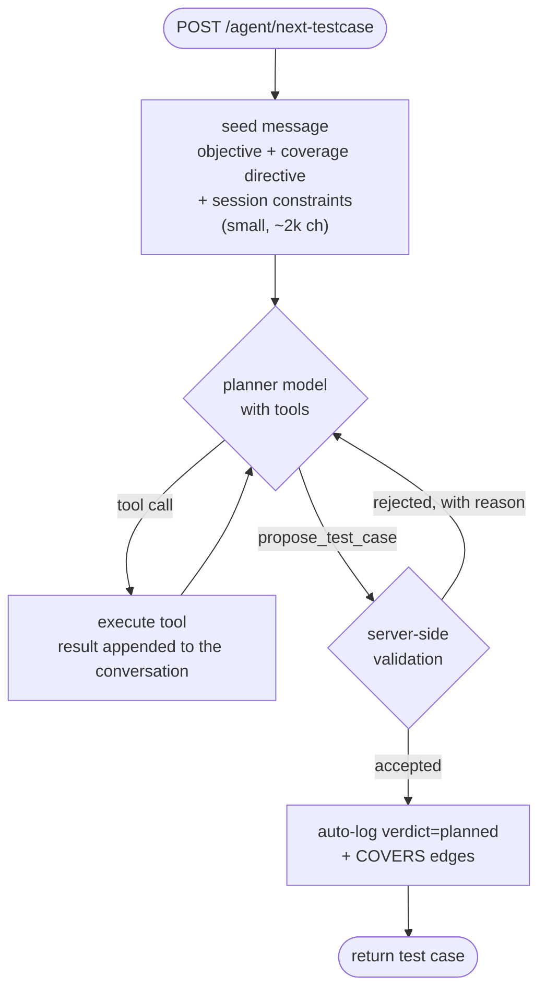

# Planner Redesign — from a retrieval pipeline to a tool-using agent

**Status: proposal. Nothing here is built.** Written 6 Sep 2026, measured against the live
`shobarkhamar` campaign of the same day.

For what the planner does today see [System_Architecture.md](System_Architecture.md) and
[PLANNER_PROMPT_ANATOMY.md](PLANNER_PROMPT_ANATOMY.md). For the investigator that now feeds it,
see [INVESTIGATOR.md](INVESTIGATOR.md).

---

## 1. The core defect: the retrieval loop is blind

`planner/langgraph_agent.py` looks like an agent — it loops, it "decides what to retrieve
next" — but **the planner never sees what it retrieved.**

In [`execute_retrieval`](../planner/langgraph_agent.py#L311), each source returns a
`RetrievedBlock` with `.text` and `.note`. The `.text` goes into a bucket that is not read again
until generation. Only `.note` — *one line* — is passed to the next round:

```python
bucket.append(block.text)              # stored, unread until the end
round_retrieved_notes.append(block.note)   # this is all the next round sees
```

Measured on the campaign run an hour ago:

```
TC-003.txt (4 LLM calls: 3 planner_step + 1 generate)
   planner_step (round 1)     in   6,805 ch      <- global context
   planner_step (round 2)     in   2,905 ch      <- decides round 3 from ONE-LINE NOTES
   planner_step (round 3)     in   3,129 ch      <-           "
   generate_testcase          in  19,118 ch      <- everything dumped at once
```

Rounds 2 and 3 each cost a model call to choose a next retrieval **without having read the
previous one**. The planner cannot tell whether what it fetched was useful, relevant, or empty.
Then every accumulated block is concatenated into one ~19k prompt and fitted to a 50k budget.

It is a retrieval **pipeline** wearing an agent's clothes. Three consequences show up in the data:

**a. `screen_hint` is unvalidated.** [`build_droidrun_goal`](../clients/executor_runner.py#L298)
records that the planner's named screen matched a real observed screen **~16% of the time**, and
the goal text now has to defensively call it "a LEAD, not a fact". Nothing checks the name
against the Live App Model before it is dispatched to a device.

**b. Deduplication is post-hoc.** The planner writes a test, `duplicate_check` detects the
overlap, and one regeneration is attempted with a blocked-titles list appended. The planner is
never able to *ask* "is this already covered?" while it is still deciding.

**c. `requirement_ids` are hallucinable.** Rule 7 of the generation prompt instructs the model to
copy ids exactly and never invent one. Nothing enforces it.

Each is currently patched after the fact. All three are the same missing capability: **the
planner cannot check anything against the graph while it is thinking.**

---

## 2. The design

A native tool-calling loop. All three configured models support it (verified against
OpenRouter's model API: `qwen/qwen3.8-flash`, `qwen/qwen3.7-flash` and `z-ai/glm-5.3-flash` all
report `tools` and `tool_choice`; the planner model also supports `structured_outputs`).

Every tool is a thin wrapper over an endpoint that **already exists** — this is plumbing, not new
capability:

| tool | backed by | replaces |
|---|---|---|
| `search_requirements(query)` | `POST /retrieve` | `srs` source |
| `get_screen(name)` | `/appmodel/graph` (+ screenshot) | `live_ui` / `figma_ui` sources |
| `list_findings(screen?, kind?)` | `GET /findings` | the "what previous runs established" block |
| `get_coverage()` | coverage map + directive | the coverage block |
| `get_nav_path(screen)` | `/navtree/retrieve-path` | `navtree` source |
| `list_untested_requirements()` | `/coverage/requirements` | *(new — currently only a count)* |
| `propose_test_case({...})` | **validating terminal tool** | `duplicate_check` + rules 5b/7/8 |

### The loop



The difference from today is small to state and large in effect: **tool results enter the
conversation**, so the model reasons over content rather than over one-line notes, and it pulls
only what it needs instead of receiving everything that fits a budget.

### `propose_test_case` — the validating terminal tool

This is where most of the value is. The planner may only finish by calling it, and the server
rejects with a reason the model must act on:

| check | rejection |
|---|---|
| `screen_hint` resolves to a real observed `UIState` (or is explicitly `"unknown"`) | `"No screen named X. Nearest observed: A, B, C. Call get_screen first."` |
| every `requirement_id` exists in the graph | `"FR-FARM-99 does not exist. Citable ids: …"` |
| not a semantic duplicate (`/tests/dedup-check`) | `"92% similar to TC-004 '…'. Choose a different behaviour."` |
| not in `settings.OUT_OF_SCOPE` | `"OTP verification is out of scope for this agent."` |
| `preconditions` create their own data | `"Precondition asserts data exists without creating it."` |

Today these are three separate post-hoc patches and two unenforced prompt rules. Here they are
one loop, and a wrong screen name becomes a caught error instead of a wasted 4-minute device run.

---

## 3. What changes

**Deleted:** `planner/sources/*` (six source classes and the registry — the tools *are* the
sources), `planner_step` / `execute_retrieval` / `should_continue`, most of
`prompts.build_testcase_prompt`'s 15-block assembly, and `duplicate_check`'s regeneration retry.

**Mostly obsolete:** `planner/budget.py`. Budget-fitting exists because everything had to be
pushed in at once; a tool loop pulls. Keep it as a guard on any single tool result.

**Kept unchanged:** `coverage.py` (becomes `get_coverage`'s implementation), the auto-log +
`COVERS` edges, `bootstrap_context` (shrinks to a small seed message), the whole
`rag_api` surface, the executor, and the investigator.

**The `ENABLED_SOURCES` guard must survive.** Today a disabled Figma source is filtered in two
places because content that bypasses the registry reaches the prompt anyway. In the new design
that becomes one rule: a disabled source's tool is **not registered**, so it cannot be called.
That is strictly safer than today.

---

## 4. Cost

Today: 4 LLM calls per test case (3 × `planner_step` at ~2.6–6.8k ch, 1 × `generate` at ~19k ch).

Expected: 6–12 calls, each small, plus one structured proposal. Slightly more calls, less total
input, and far less *wasted* input — today's 19k generation prompt contains every block that fit,
relevant or not.

Worth keeping in proportion: executing one test costs up to `EXECUTOR_MAX_STEPS` (50)
vision-bearing model calls. **Planning is already the cheap half.** The current design spends its
budget on one enormous prompt rather than several sharp ones, and one prevented bad
`screen_hint` saves more than the whole planning loop costs.

---

## 5. Risks

1. **Tool-call failures need the same degradation discipline as the investigator.** A model that
   loops calling tools without proposing must hit a hard call ceiling and fall back to
   single-shot generation from whatever it gathered — never return nothing.
2. **Rejection loops.** `propose_test_case` must cap rejections (2–3) and then accept the best
   effort with the failure recorded, or a stubborn model burns calls forever.
3. **It is a real rewrite** of the file that decides what gets tested at all. Bigger than the
   investigator change, and worth doing behind a flag (§6).
4. **Tool-calling quality is unmeasured on these models.** They *support* tools; whether
   `qwen3.8-flash` uses them *well* is unknown. Phase 0 exists to find out cheaply.

---

## 6. Phasing

Each phase is independently useful and independently revertable.

- **Phase 0 — spike (half a day).** Three tools (`search_requirements`, `get_screen`,
  `list_findings`) against one real objective, offline. Answers the only open question that
  matters: does this model drive tools competently? Stop here if not.
- **Phase 1 — `propose_test_case` validation, inside the CURRENT planner.** No tool loop yet:
  validate the generated test, and on rejection re-prompt with the reason instead of the current
  blocked-titles retry. Delivers the screen-grounding and id-checking wins immediately, at low
  risk, and is useful even if the rest is never built.
- **Phase 2 — the tool loop**, behind `PLANNER_MODE=tools|pipeline`, defaulting to `pipeline`.
  Both paths live side by side; switch per campaign and compare.
- **Phase 3 — delete the pipeline** once Phase 2 wins on the criteria below.

---

## 7. How we would know it is better

Measured over a campaign of equal length on the same app, against the `pipeline` default:

| metric | today | target | where from |
|---|---|---|---|
| `screen_hint` matches a real observed screen | ~16% | **>80%** | validated at proposal |
| Tests citing a requirement id that exists | unmeasured | **100%** | validated at proposal |
| Duplicate regenerations needed | 1 retry, post-hoc | ~0 | planner checks first |
| Runs ending `STEP_LIMIT_EXCEEDED` | the dominant agent failure | lower | fewer hunts for absent screens |
| Autonomy (non-agent-fault runs) | 50% (README) | higher | ditto |
| Planning cost per test | 4 calls / ~31k ch in | ≤ 12 calls, less total input | logged per call |

The first two are the honest ones: they are directly caused by the redesign and directly
measurable. Autonomy is the outcome we actually care about, but it moves for many reasons, so it
should not be the acceptance test on its own.

---

## 8. Explicitly not in scope

- **Vision at planning time** already exists (a target screen's screenshot is attached in
  `generate_testcase`); it becomes a return value of `get_screen` and needs no separate work.
- **Consuming `AGENT_DIFFICULTY` findings** ([INVESTIGATOR.md](INVESTIGATOR.md) §11,
  [PLANNER_IMPROVEMENTS_FUTURE.md](PLANNER_IMPROVEMENTS_FUTURE.md) #1) is a separate, smaller
  change that pays off under either design — it should not wait for this one.
- Changing the executor, the investigator, or the graph schema.
