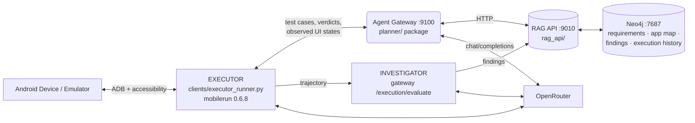
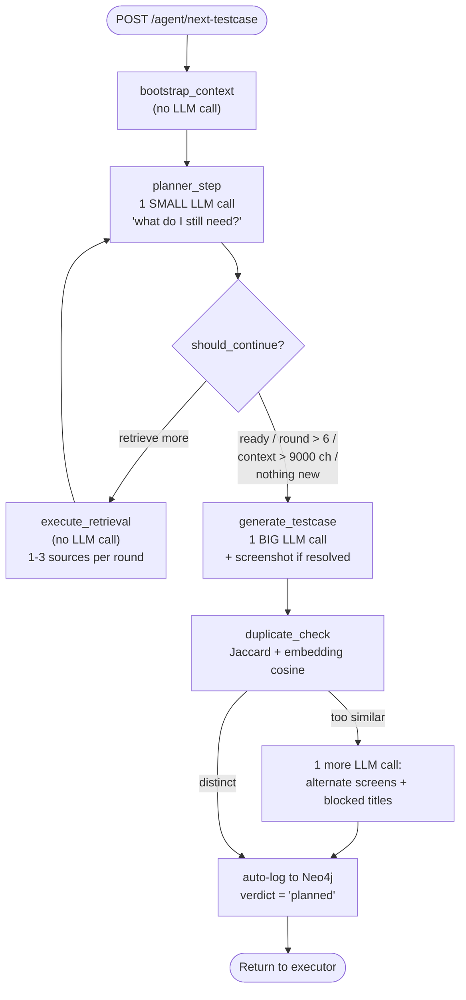

# System Architecture

The technical reference: what the components are, how a test case flows through them, and where
the code lives. For the narrative version and how to run it, read
[WORKFLOW.md](WORKFLOW.md) first. Deep dives:
[PLANNER_REDESIGN.md](PLANNER_REDESIGN.md) (tool planner) ·
[PLANNER_PROMPT_ANATOMY.md](PLANNER_PROMPT_ANATOMY.md) (the pipeline planner's prompt) ·
[INVESTIGATOR.md](INVESTIGATOR.md) (trajectory → findings) · [ROADMAP.md](ROADMAP.md) (what's next).

---

## 1. High-level system



Three LLM roles, three distinct `X-Title`s in OpenRouter's dashboard:

| role | model | app label |
|---|---|---|
| Planner | `qwen/qwen3.7-flash` | QA Planner Agent |
| Executor | `qwen/qwen3.7-flash` | QA Executor Agent |
| Investigator | `z-ai/glm-5.3-flash` | QA Evaluator Agent |
| SRS ingestion | `EXTRACTION_MODEL` | QA SRS Ingestion |

`FALLBACK_MODEL` (`z-ai/glm-5.3-flash`) takes over when the primary is rate-limited. After a model
exhausts its retries it is skipped for `_RATE_LIMIT_COOLDOWN_S` (180s) rather than re-paying the
2+4+8s backoff on every subsequent call — that backoff was measured at ~112s of a 115s planning
round during a rate-limit storm.

## 2. Code map

| path | role |
|---|---|
| `gateway/main.py` | thin FastAPI router; also hosts `/execution/evaluate` (the investigator) and the dashboard |
| `planner/langgraph_agent.py` | pipeline planner — LangGraph state machine (§4) |
| `planner/agent_loop.py` · `tools.py` · `proposal.py` | tool planner — agent loop, 7 tools, validation gate (§5) |
| `planner/model_client.py` | LLM transport: `call_model` (single prompt) and `chat_tools` (tool calling), retry + fallback + cooldown |
| `rag_api/main.py` | Neo4j knowledge graph, 57 endpoints |
| `rag_api/findings.py` | findings storage, dedup-and-reinforce, kind taxonomy |
| `rag_api/{learning,navtree,risk,anomalies,metrics,defects}.py` | derived intelligence over execution history |
| `ingestion/` | SRS/Figma → canonical IR; `app_state.py` = UI-state identity |
| `clients/executor_runner.py` | device executor; `crawl_runner.py` maps an app without testing it |
| `observability/` | structured logs, metrics, and the cross-process degradation sink |

## 3. The planner: two implementations

Selected by `PLANNER_MODE`; both return the identical test-case contract, so the executor,
dashboard and reporting are unaffected either way.

| | `pipeline` (default) | `tools` |
|---|---|---|
| retrieval | fixed loop; model sees one-line **notes**, not content | tool calls; model reads real results |
| prompt | ~15 blocks assembled, budget-fitted, ~19k chars | small seed + whatever it fetches |
| screen grounding | none | validated against observed screens |
| requirement ids | requested, unenforced | rejected if they don't exist |
| dedup | after generation, one blind retry | before committing, with a reason |
| cost | 4 LLM calls | 7–8 turns / 12–15 tool calls, ~67s |

## 4. Pipeline planner — the state machine



**Only 3 of the 5 nodes call an LLM** — `bootstrap_context` and `execute_retrieval` are pure graph
reads. A burst of 2–6 OpenRouter calls at one timestamp is one generated test case; the single
large call is `generate_testcase`, the small ones are `planner_step` rounds. Two large calls means
`duplicate_check`'s retry fired.

### 4.1 Knowledge sources

`execute_retrieval` dispatches up to 3 requests per round through `planner/sources/registry.py`,
to sources that are **registered, enabled (`ENABLED_SOURCES`), and have data for this project**.
No source is a hard dependency.

| source | returns | available when |
|---|---|---|
| `srs` | hybrid vector+keyword+graph-hop over requirements | an SRS was ingested |
| `figma_ui` | interactive elements for one **design** screen | a Figma export was ingested |
| `figma_flow` | design-file screen transitions | a Figma export was ingested |
| `live_ui` | the **observed** app map — real screens and control names | the executor has run at least once |
| `defects` | historical defect reports for an area | defects have been ingested |
| `navtree` | the proven shortest route the executor actually walked | transitions have been recorded |

`live_ui` **is** screen-targeted: given a screen name it fuzzy-matches the observed `UIState`
labels (`LIVE_SCREEN_MATCH_THRESHOLD`), returns that screen's real controls, and reports a
`resolved_state` which the agent collects into `selected_live_states`. That is what lets
`generate_testcase` attach the screen's **stored screenshot** to the generation call — vision at
planning time is implemented, capped at one image (the primary target only).

If the planner returns no usable retrieval requests, `_default_requests()` fills in a sane default
rather than the round doing nothing. The loop exits via `should_continue()` when the model signals
`produce_testcase`, a round retrieves nothing new, SRS context exceeds 9,000 chars, or
`max_retrieval_rounds` (capped at 6) is reached.

### 4.2 The prompt budget

`generate_testcase` assembles ~15 candidate blocks and hands them to `planner/budget.py`, which
fills them **highest-priority-first** into one shared `PROMPT_BUDGET_TOKENS` ceiling (50,000).
Lowest priority is truncated or dropped first; priority-0 is never dropped.

| priority | blocks |
|---|---|
| 0 | requirements, SRS context, UI context |
| 1 | what previous runs established, already-done titles |
| 2 | defect history, regression risk, anomalies, learned route, failed routes, strategy memory |
| 3 | UI overview, screen transitions, already-failed titles |

The priority-1 "what previous runs established" block reads **findings**, not the investigator's
prose — that block was 69% of one measured generation prompt before the change (35,233 of 51,002
chars) and is ~2,000 chars now.

## 5. Tool planner

A native tool-calling loop over 7 tools, each a thin wrapper on an existing endpoint:
`search_requirements`, `list_untested_requirements`, `get_screen`, `list_screens`,
`list_findings`, `get_coverage`, `get_nav_path`. Only tools whose source is enabled and has data
are registered, so a disabled source is **uncallable** rather than merely un-advertised.

The loop terminates in `propose_test_case`, which is validated server-side
(`planner/proposal.py`) and rejects with a correctable reason:

- `screen_hint` must name an observed `UIState` (or be `"unknown"`) — the rejection lists the real alternatives
- `requirement_ids` must exist, or the `COVERS` edge silently fails
- not a semantic duplicate of an executed test
- not in `OUT_OF_SCOPE`; preconditions must be creatable through the UI

After `FORCE_PROPOSE_AFTER` (6) turns the model is instructed to propose and `tool_choice` is
pinned to the proposal tool — left on `auto` it will investigate to the ceiling and never commit.
Rejections are capped at 3, after which the best effort is accepted and a degradation is recorded.

## 6. Executor

Receives a **goal, not a tap script** (`build_droidrun_goal`). The planner cannot see the live app,
so `screen_hint` is passed as "a LEAD, not a fact" — measured, the planner's named screen matched a
real observed screen ~16% of the time under the pipeline planner, which is what the tool planner's
validation gate addresses.

Per run: `AndroidDriver` connects, the mobilerun portal is asserted (CRITICAL degradation if
absent), and `MobileAgent` runs with `EXECUTOR_MAX_STEPS` (50) and `EXECUTOR_TIMEOUT` (900s).
Every `RecordUIStateEvent` is re-observed from the device (the streamed payload carries no
content-descriptions or package) and POSTed to `/liveui/observe`.

Failures are classified (`classify_failure`) into an app/agent/environment taxonomy defined once
in `settings.py`. `SELF_HEAL` gives one adaptive retry for recoverable categories.
`STEP_LIMIT_EXCEEDED` and `PRECONDITION_NOT_MET` are deliberately **not** defect evidence and are
excluded from hot spots via `NON_INFORMATIVE_ERRORS`.

### UI-state identity

`ingestion/app_state.py` decides whether a screen is new. Identity is a hash of the *structural
skeleton* — controls by `(resource_id, class, content_description, clickable)` plus
package/activity and dialog state. Volatile text is dropped, so scrolling a list or switching
theme is the **same** state. Exact signature is the fast path; structural Jaccard tolerates minor
chrome; a perceptual screenshot hash is the fallback for thin accessibility trees.

## 7. Investigator

After `/execution/log`, the executor calls `/execution/evaluate` with the exact trajectory folder.
The investigator reads the trajectory (≤50 steps), the screens it touched, and the findings
already known **for those screens**, then emits atomic findings in 8 kinds. Repeats reinforce an
existing finding by ref (`times_seen++`) rather than duplicating. Full detail:
[INVESTIGATOR.md](INVESTIGATOR.md).

Kinds route to different consumers, defined once in `rag_api/findings.py`:
`oracle` (bug evidence) · `ui` (discovered controls) · `agent` (our own difficulties — never
presented as app defects).

## 8. The knowledge graph

```
(:Project)-[:HAS_SRS]->(:SRS)-[:HAS_CHUNK]->(:Chunk)          # + embedding
(:Project)-[:HAS_REQUIREMENT]->(:Requirement)-[:HAS_RULE]->(:ValidationRule)
(:Project)-[:HAS_STATE]->(:UIState)-[:TRANSITIONS_TO {action}]->(:UIState)
(:Project)-[:HAS_FINDING]->(:Finding)-[:ABOUT_SCREEN]->(:UIState)
                                    -[:FOUND_BY]->(:ExecutionLog)
                                    -[:CONCERNS]->(:Requirement)
(:Project)-[:HAS_TEST]->(:TestCase)-[:COVERS]->(:Requirement)
(:NavTreeNode)-[:CHILD]->(:NavTreeNode)                        # proven routes, avoid flags
```

Vector indexes `chunk_embedding` and `requirement_embedding` are created at RAG-API startup when
embeddings are enabled.

**Reset slices** — `delete_tests` (`CLEAN_SLATE`, default on) wipes outcomes: tests, execution
logs, nav memory, error patterns, strategies. `delete_appmodel` (`CLEAN_SLATE_APPMODEL`, default
**off**) wipes knowledge: the app map **and findings**. Findings sit on the knowledge side
deliberately — they outlive the run that discovered them.

## 9. Cross-cutting

**Verdict lifecycle.** A generated test is logged immediately with `verdict="planned"`. An earlier
version logged `"pass"` here, inventing passing tests that never ran and poisoning coverage, risk
and effectiveness. Coverage math and `NON_INFORMATIVE_ERRORS` filtering exclude `"planned"` rows.

**Explore vs exploit.** `EXPLORATION_MODE` (`exploit` | `explore` | `balanced`) biases
`coverage.build_exploration_directive()`: dig into what has broken, push into untested areas, or
investigate failures then expand.

**Degradations.** `observability/degradations.py` writes to a shared JSONL sink, not per-process
state — the executor and API are separate processes, and per-process counters made every
executor-side degradation invisible to the dashboard. Occurrences are counted and sampled.

## 10. Known gaps

- The tool planner is **not the default** — it has not yet been proven better over a campaign
  ([ROADMAP.md](ROADMAP.md) §4).
- `proposal.validate` skips the screen check when the app model is **empty**, so a cold-start run
  has no grounding at all (ROADMAP.md §3.1).
- Findings never decay or retire; a fixed defect stays in the oracle forever (ROADMAP.md §3.4).
- Cached vision captions for thin-tree screens are still unbuilt — direct vision at generation
  time is implemented (ROADMAP.md §3.7).
