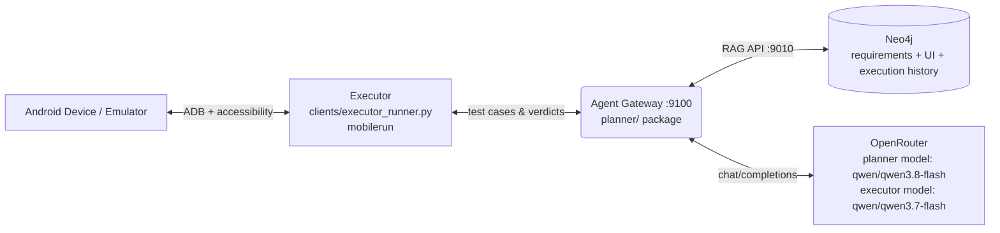
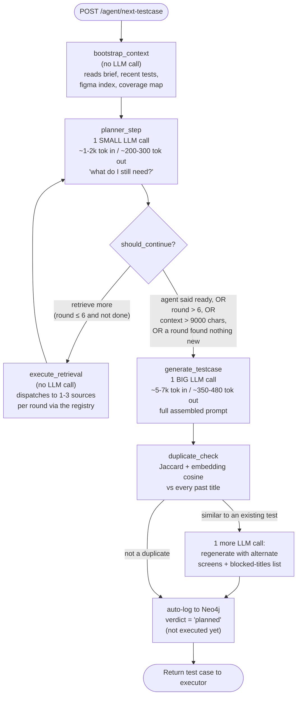

# Planner Architecture — How Test-Case Generation Actually Works

This is the detailed reference for `planner/langgraph_agent.py` — what happens between the
executor asking "what should I test next?" and a JSON test case coming back. For what's
actually *inside* the biggest prompt (the generation call), see
[PLANNER_PROMPT_ANATOMY.md](PLANNER_PROMPT_ANATOMY.md). For proposed next steps, see
[PLANNER_IMPROVEMENTS_FUTURE.md](PLANNER_IMPROVEMENTS_FUTURE.md).

## 1. High-level system



The gateway is a thin FastAPI router over `planner/`; all the logic described below lives in
`planner/langgraph_agent.py` as a **LangGraph state machine**, not in the gateway itself.

## 2. The state machine (one call = one generated test case)



**Only 3 of these 5 nodes ever call an LLM** — `bootstrap_context` and `execute_retrieval` are
pure Neo4j/`rag_client` reads. That matters for reading OpenRouter's usage table: a burst of
2-6 calls at the same timestamp is one `run_agent()` invocation, i.e. one generated test case.
The **one large call** in each burst (5,000-7,000 tokens in) is always `generate_testcase`; the
**several small calls** (1,200-2,000 tokens in, ~200-300 out) are `planner_step` rounds deciding
what to fetch next — they never see the full prompt, just a compact "retrieve or produce?"
question. A burst with two large calls means `duplicate_check`'s retry fired.

## 3. The retrieval loop, in detail

Each `planner_step` round asks the model one question: *given what's been gathered so far,
retrieve more, or generate now?* It answers as JSON:

```json
{"action": "retrieve", "retrieval_requests": [{"source": "srs", "query": "email format validation"}],
 "focus_queries": ["email format validation"], "target_screens": ["Login"], "reason": "..."}
```

`execute_retrieval` then dispatches up to 3 requests per round through `planner/sources/registry.py`
to whichever knowledge sources are **registered, enabled, and have data for this project**
(`sources_registry.available_sources()` — a project with no Figma export simply never sees
`figma_ui`/`figma_flow` advertised, and the model is told to rely on live/heuristic sources
instead). Six sources exist today:

| source | channel | what it returns | available when |
|---|---|---|---|
| `srs` | `srs` | hybrid vector+keyword+graph-hop retrieval over requirements | an SRS was ingested |
| `figma_ui` | `figma_ui` | interactive elements for one named **design** screen | a Figma export was ingested |
| `figma_flow` | `figma_flow` | screen-to-screen navigation transitions from the design file | a Figma export was ingested |
| `live_ui` | `figma_ui` (shares the same prompt slot) | an overview of the **observed** app map — real screens the executor has actually reached, with real control names | the executor has run at least once (Live App Model has states) |
| `defects` | `defects` | historical defect reports for an area/query — bias generation toward what has broken before | any defects have been logged |
| `navtree` | `navtree` | the proven shortest navigation path the executor has actually walked to a screen | the executor has recorded transitions |

Two bookkeeping quirks worth knowing if you're extending this:

- Only the `figma_ui` request path resolves a screen name into `state["selected_screens"]`
  ([langgraph_agent.py:236-241](../planner/langgraph_agent.py#L236-L241)) — this is what
  `generate_testcase` later uses to pull screen-specific context. `live_ui` has no equivalent
  targeting today: it always returns a generic top-12-node overview of the whole app map,
  regardless of what screen was asked for. This also means `selected_screens` lives in the
  **Figma design-file naming space**, not the Live App Model's `UIState` id/label space — the
  two are not currently reconciled (see PLANNER_IMPROVEMENTS_FUTURE.md #4 for why this matters
  for attaching screenshots).
- If the planner returns no usable retrieval requests, `_default_requests()`
  ([langgraph_agent.py:183-192](../planner/langgraph_agent.py#L183-L192)) fills in a sane
  default (SRS query from the objective; Figma screen from a fallback list) rather than the
  round doing nothing.

The loop exits (`should_continue()`, [langgraph_agent.py:268-276](../planner/langgraph_agent.py#L268-L276))
when the model itself signals `produce_testcase`, when a round retrieved nothing new
(`no_new_context_early_finalize`), when accumulated SRS context exceeds 9,000 chars
(`context_limit_reached`), or after `max_retrieval_rounds` (hard-capped at 6) — whichever
comes first.

## 4. Building the generation prompt: a global token budget, not per-block caps

`generate_testcase` assembles ~15 candidate context blocks and hands them to
`planner/budget.py`, which fills them **highest-priority-first** into one shared
`PROMPT_BUDGET_TOKENS` ceiling (default 50,000) instead of giving every block its own
independent character cap. When the budget is tight, lowest-priority content is truncated or
dropped first — priority-0 blocks are never dropped, even if that means exceeding budget
(reported in `debug_trace` instead of silently losing the requirement text).

Current priorities ([prompts.py:234-247](../planner/prompts.py#L234-L247)):

| priority | blocks |
|---|---|
| 0 (never dropped) | requirements context, SRS context, Figma UI context |
| 1 | known-failure context, list of already-done test titles |
| 2 | defect history, regression-risk ranking, anomaly alerts, learned navigation path, failed-navigation avoid-list, strategy-effectiveness memory |
| 3 | Figma overview, Figma flow/transitions, list of already-failed test titles |

In practice this prompt runs far under budget — see PLANNER_PROMPT_ANATOMY.md for a live
measurement (~6,600 tokens / 13% of the ceiling on the current campaign), so there's headroom
before this budgeting logic actually has to drop anything.

## 5. Duplicate check and the one-shot retry

After generation, `duplicate_check` runs two independent similarity checks against every
already-logged title: a cheap local Jaccard pre-filter (`textutil.is_similar_to_existing`,
threshold 0.60) and a server-side embedding-cosine check (`rag_client.semantic_dedup_check`).
If either flags a duplicate, the graph regenerates **once** with a different set of Figma
screens and an explicit blocked-titles list appended to the prompt — it does not loop
indefinitely chasing novelty.

## 6. Auto-log and the verdict lifecycle

A freshly generated test is logged to Neo4j immediately with **`verdict = "planned"`** — not
`"pass"`. It has not run yet; a prior version of this pipeline logged `"pass"` here, which
invented passing tests that never executed and silently poisoned coverage, risk-scoring, and
test-effectiveness metrics. The verdict only becomes `"pass"` or `"failed"` once the executor
actually runs the test and reports back. Coverage math, `NON_INFORMATIVE_ERRORS` filtering, and
effectiveness metrics all explicitly exclude `"planned"` rows for this reason.

## 7. Explore vs. exploit

`EXPLORATION_MODE` (`exploit` | `explore` | `balanced`, default `balanced`) biases
`coverage.build_exploration_directive()`'s hint text fed into the prompt:

- `exploit` — drill into areas that have already broken (defect-prone depth).
- `explore` — push into untested areas first (coverage breadth).
- `balanced` — investigate recent failures first, then expand into gaps (default).

## 8. Known gaps (tracked separately)

- The retrieval loop can request `live_ui`, but that source isn't screen-targeted yet — see
  PLANNER_IMPROVEMENTS_FUTURE.md for the fix and what it would unblock (per-screen "known agent
  difficulty" hints, screenshot attachment, trajectory-grounded steps).
- No vision input reaches any planner LLM call today — `model_client.py`'s OpenRouter path
  sends text only, even though both the planner and executor models are multimodal on
  OpenRouter. Also tracked in PLANNER_IMPROVEMENTS_FUTURE.md.
