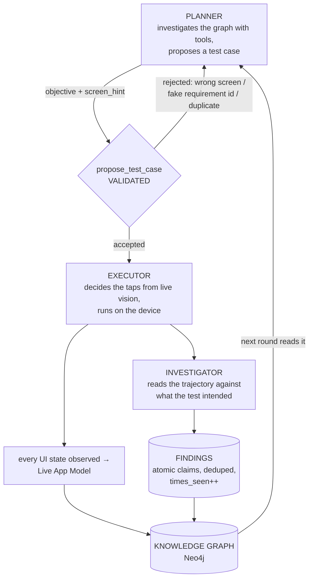

# How the system works, end to end

The one document to read first. What the three agents are, how a test case goes from an idea to
a finding in the graph, and what to run.

Deeper references: [System_Architecture.md](start/System_Architecture.md) (how the three agents
work together) · [PLANNER.md](PLANNER.md) (how the planner works) ·
[PLANNER_REDESIGN.md](PLANNER_REDESIGN.md) (why the tool planner exists) ·
[INVESTIGATOR.md](INVESTIGATOR.md) (trajectory → findings) ·
[GETTING_STARTED.md](start/GETTING_STARTED.md) (first-time setup) · [ROADMAP.md](ROADMAP.md) (what's next).

---

## 1. The idea in one paragraph

Give the agent an app and (optionally) its requirements. It writes one exploratory test at a
time, runs it on a real Android device, works out what the run actually established, and writes
that into a knowledge graph. The next test is planned from the grown graph. No knowledge source
is required — with no requirements and no design file, the agent explores the live app and
builds its own map.

## 2. Three agents, three questions

| agent | question | model | where |
|---|---|---|---|
| **Planner** | what should we test next? | `qwen3.7-flash` | gateway `:9100` |
| **Executor** | how do I actually do it on this device? | `qwen3.7-flash` + mobilerun | `clients/executor_runner.py` |
| **Investigator** | what did that run establish? | `glm-5.3-flash` | gateway `/execution/evaluate` |

Plus two services: **RAG API** `:9010` (Neo4j knowledge graph) and **Neo4j** `:7687`.

## 3. The loop



**One round = one test case.** The planner does not remember the previous round; it re-reads the
graph, which has grown. That is what "learning" means here — see §6.

> The validation step shown above exists in `PLANNER_MODE=tools`. The **default** is still
> `pipeline`, which generates first and checks for duplicates afterwards, with no screen or
> requirement-id grounding. Everything else in the loop is identical. See §4.

## 4. What each step actually does

### Planner
Two implementations, chosen by `PLANNER_MODE`:

- **`pipeline`** (default) — a LangGraph state machine: bootstrap context → decide what to
  retrieve → retrieve → generate → duplicate-check. See [System_Architecture.md](start/System_Architecture.md).
- **`tools`** — a tool-calling agent with 9 tools over the graph
  (`search_requirements`, `list_untested_requirements`, `get_screen`, `list_screens`,
  `findings_summary`, `list_findings`, `list_open_questions`, `get_coverage`,
  `get_nav_path`), terminating in a **validated** `propose_test_case`.
  See [PLANNER.md](PLANNER.md) for how it works.

The validation gate is the important part: a `screen_hint` naming a screen the app has never
been observed to have, an invented requirement id, a semantic duplicate, or an out-of-scope area
is **rejected with a fixable reason** instead of becoming a wasted device run.

Only tools whose knowledge source is enabled *and* has data are registered. A project with no
Figma never sees Figma tools; a project before its first run sees no screen tools at all and must
plan from requirements alone.

### Executor
Receives a **goal, not a tap script**. The planner cannot see the live app, so `screen_hint` is
passed as "a LEAD, not a fact" and the executor works out the route from the accessibility tree
and screenshots. Each observed UI state is deduped into the Live App Model by structural
signature (text dropped, so scrolling and theme changes are the *same* screen). One self-heal
retry on classified failures.

### Investigator
After each run, reads the trajectory (≤50 steps) plus findings already known for the screens it
touched, and emits **atomic findings** in 8 kinds:

`SPEC_VIOLATION` · `SUSPECTED_DEFECT` · `CONFIRMED_BEHAVIOUR` · `SPEC_GAP` ·
`UNEXPECTED_BEHAVIOUR` · `UNVERIFIED` · `CONTROL_DISCOVERED` · `AGENT_DIFFICULTY`

Kinds are defined by which consumer routes on them. `AGENT_DIFFICULTY` (our agent got stuck) is
deliberately kept **out** of the bug oracle — it steers test design, it is not evidence the app
is broken. A finding restating a known one reinforces it (`times_seen++`) instead of duplicating.

## 5. Where knowledge lives

```
(:Project)-[:HAS_FINDING]->(:Finding)-[:ABOUT_SCREEN]->(:UIState)
                                     -[:FOUND_BY]->(:ExecutionLog)
                                     -[:CONCERNS]->(:Requirement)
(:Project)-[:HAS_STATE]->(:UIState)-[:TRANSITIONS_TO {action}]->(:UIState)
(:Project)-[:HAS_REQUIREMENT]->(:Requirement)-[:HAS_RULE]->(:ValidationRule)
(:Project)-[:HAS_TEST]->(:TestCase)-[:COVERS]->(:Requirement)
(:NavTreeNode)-[:CHILD]->(:NavTreeNode)        # proven routes, avoid flags
```

This **is** the agent's memory — semantic (findings, requirements), spatial (the app map),
procedural (nav routes), episodic (execution logs), and meta (strategy/error patterns). It is a
knowledge graph rather than a vector store, which is what lets it answer relational questions
("which route reaches this screen", "which requirement does this finding violate").

**Lifetime across campaigns** — the split that matters:

| slice | flag | default | why |
|---|---|---|---|
| test results, execution logs, nav memory | `CLEAN_SLATE` | wiped | outcomes; wipe for a clean measurement |
| **app map + findings** | `CLEAN_SLATE_APPMODEL` | **kept** | knowledge about the app; wiping it makes every campaign start blind |

## 6. What "the agent gets smarter" does and does not mean

**Supported by measurement:** knowledge accumulates without bloating — findings dedupe and
reinforce, and the investigator's prompt *shrank* across a campaign (20,466 → 10,959 chars) where
the old prose design grew (28,344 → 97,796). The planner reads that knowledge every round
(`list_findings` called 18 times across recent rounds). Over one 3-round campaign the graph went
from 23 → 28 findings (37 observations, so 9 were reinforcements rather than duplicates) and
32 → 40 observed screens.

**Not yet established:** that this produces better tests or finds more defects. There is no
ground truth, no seeded-defect build, and no ablation. See [ROADMAP.md](ROADMAP.md) §"Proving it
works" — this is the single most valuable thing left to do.

## 7. Running it

```bash
./start.sh                                          # Neo4j + emulator + RAG API + gateway
EXECUTOR_ROUNDS=3 ./venv/bin/python clients/executor_runner.py
```

Opt into the tool planner by starting the **gateway** with it (the planner runs there, not in the
executor):

```bash
PLANNER_MODE=tools ./venv/bin/python -m uvicorn gateway.main:app --port 9100
```

Watch it:

```bash
tail -f logs/mobilerun.log                          # what the agent is doing on the device
open http://127.0.0.1:9100/dashboard?project=$PROJECT
less logs/planner/TC-001.txt                        # every LLM call that produced a test case
less logs/investigator/TC-001.txt                   # the investigator's exact input and output
```

Inspect what it learned:

```bash
curl "http://127.0.0.1:9010/findings/stats?project=$PROJECT" | python3 -m json.tool
curl "http://127.0.0.1:9010/findings?project=$PROJECT&group=oracle&limit=10" | python3 -m json.tool
curl "http://127.0.0.1:9010/findings?project=$PROJECT&group=agent&limit=10"  | python3 -m json.tool
curl "http://127.0.0.1:9010/appmodel/graph?project=$PROJECT" | python3 -m json.tool
```

Tests — 6 modules, non-zero exit on failure. Graph-backed modules skip cleanly with
no Neo4j:

```bash
./venv/bin/python tests/run_all.py
```

⚠️ `scripts/ingest_all.py` **always** resets tests, SRS *and* Figma. Don't run it to refresh one
of them.

### Resuming an interrupted campaign

A batch stopped by a power cut or a network outage does not have to be restarted from scratch —
every round writes its verdict, execution log and findings as it completes, so only the round in
flight is lost.

```bash
RESUME=1 EXECUTOR_ROUNDS=13 ./venv/bin/python clients/executor_runner.py
```

`RESUME=1` keeps every existing test, continues ids from the highest already in the graph, and
takes no campaign snapshot — it is the same campaign, not a new one. Without it a run starts by
wiping test history, which is correct for a clean measurement and wrong for a resume.

### Unstable internet

The agent treats an outage as a **pause, not an error**. A connectivity failure (DNS, refused
connection, unreachable network) is retried on a long schedule of roughly 32 minutes total, with
`network_down` / `network_back` logged so a gap in a campaign is explainable afterwards. Falling
back to another model is pointless during an outage — every backend is behind the same
connection — so it waits rather than switching.

If a planning call still fails after that, the executor retries the round `ROUND_RETRIES` times
before stopping, and stops *cleanly*: everything completed so far is already in the graph, and
`RESUME=1` picks up from there.

## 8. Configuration that changes behaviour most

| setting | default | effect |
|---|---|---|
| `PLANNER_MODE` | `pipeline` | `tools` switches to the tool-calling planner |
| `ENABLED_SOURCES` | srs, live_ui, defects, navtree | a disabled source's tools are never registered |
| `OUT_OF_SCOPE` | — | areas the planner may never test; enforced at proposal time |
| `APP_LOGIN_*` | — | credentials; the secret reaches only the executor, never the planner prompt |
| `EXECUTOR_MAX_STEPS` / `EXECUTOR_TIMEOUT` | 50 / 900s | the executor's budget per test |
| `EXPLORATION_MODE` | `balanced` | `explore` = breadth first, `exploit` = dig into failures |
| `AREA_SATURATION` | `5` | tests in one area before it stops being promoted — stops the planner tunnelling on one screen |
| `EVALUATOR_REASONING_EFFORT` | `low` | the investigator's latency lever (113.8s → 22.7s) |
| `CLEAN_SLATE_APPMODEL` | `false` | `true` wipes the app map **and findings** — start blind |
| `RESUME` | `false` | `true` continues the existing campaign: nothing deleted, ids carry on, no snapshot |
| `ROUND_RETRIES` / `ROUND_RETRY_WAIT_S` | 5 / 30s | how hard a failed planning call is retried before the batch gives up |
